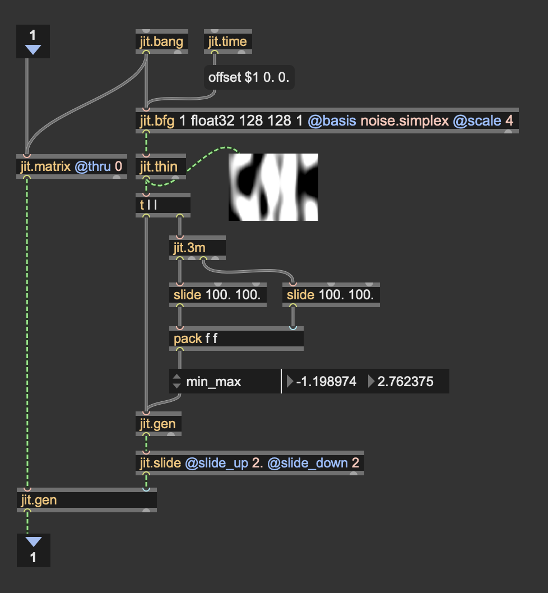

# Thickness

A very desirable operation to perform on a mesh is diplacing the triangles of which it is composed. Althoug not evident on closed meshes, when displaced, triangles look flat and volumeless. This patch uses a custom geometry script to account for that.

## Let's thicken them up

Open the patch *thickness.maxpat*

This patch takes a Jitter geometry and extrudes the triangles along their vertex normals, forming truncated pyramids of user-defined height. It then performs a random displacement of such extruded triangles to show them in all their glorious thickness.

Let's give a look at the patch:

The first step consists in grabbing a mesh, turning it into a Jitter geometry, and computing vertex normals using {jit.geom.normgen}. Each vertex in the Jitter geometry structure now retains vertex normals.

Then, {jit.geom.todict} converts the Jitter geometry into a dictionary accesible by JavaScript.

double-click on {v8 geom.thickness.js} to give a look at what the custom geometry script does.

The script iterates over the triangles reading the positions and the normal vectors of the 3 vertices. It then computes 3 new positions, shifting each vertex inwards along the direction of their vertex normals.

It then triangulates the old and the new positions forming a volume. 

Now, open the [p animate] subpatch if you want to give a look at how is the mesh dancing.

The animation is achieved offsetting the volumes' positions along their face normals using a procedural noise provided by {jit.bfg}