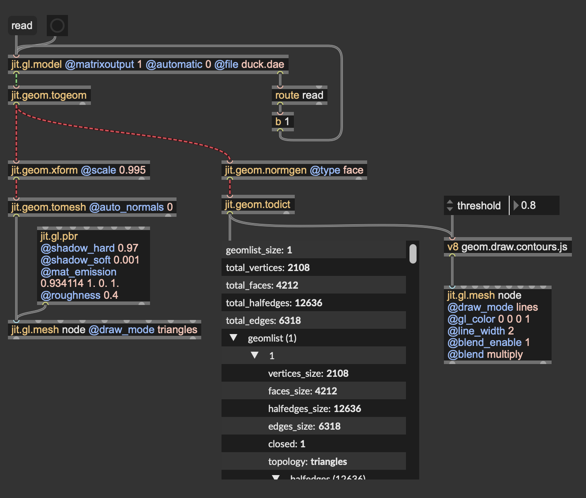

# Drawing contours

If you had a pencil and paper, and you had to draw a duck, what would your drawing look like? I had fun putting together a patch that takes a Jitter geomerty and draws some lines along the contours of the mesh.

## Pencil and paper

Open the patch *contours.maxpat*.

Looking at the render, you can see that the mesh outlines have been drawn. But, how can we identify which portions of the mesh should be considered pare of the outlines? Give a look at the geom operators

The first step consists in grabbing a mesh, turning it into a Jitter geometry, and computing face normals using {jit.geom.normgen}. They will come in handy later on. Then, {jit.geom.todict} converts the Jitter geometry into a dictionary accesible by JavaScript.
Now, double-click on {v8 geom.draw.contours.js} to give a look at the custom geometry script.

The core algorithm is pretty simple: iterate over the edges of the mesh checking the orientation (face normals) of the two faces divided by the edge; if the cosine of the angle formed by the adjacent faces is minor than a user-defined threshold, then draw a line connecting the endpoints of the edge.