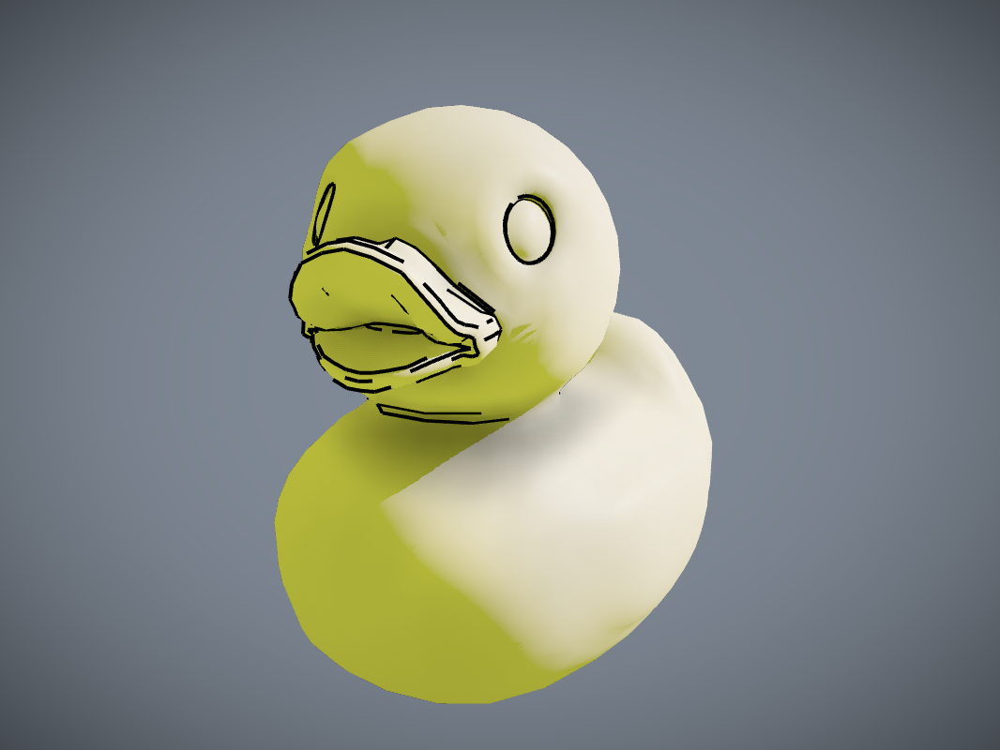

# Drawing contours

If you had a pencil and paper, and you had to draw a duck, what would your drawing look like? I had fun putting together a patch that takes a Jitter geomerty and draws some lines along the contours of the mesh.

## Pencil and paper

Open the patch *contours.maxpat*.

If you just watch the animation for a second, you'll see what I was going for here. First the torus twists on one side, then it untwists itself, then it does the same thing on the other side. The key to making this all work is very precise timing.

If you pop open the subpatch *[p precise-timing]*, you'll see what's going on. Every four seconds is divided into four phases: twist right, untwist right, twist left, and untwist left. The left branch of the patch manages updating the twist angle, and the right branch flips the axes of the two {jit.geom.twist} objects, so that the first work on the right side of the shape, and then the left.

One kind of cute touch with this patch is the striped texture that we apply to the surface of the torus. You can see that the generated texture just makes a bunch of stripes, but if you look at the left and right edges, you can see that one color always matches with the other. That means that when the texture is applied to the torus, everything lines up seamlessly.

## Pattern Wheel

Open up the patch *pattern-wheel.maxpat*.

I made this patch sort of by accident when I was trying to make the other one. It's much simpler, although you could argue it makes more complex shapes.

By default, the torus is twisting around the Y axis. Of course, a torus has radial symmetry about the Y axis (in its default orientation anyway), so this doesn't change the surface of the shape much. But when we apply a checkerboard texture, you can see lots of cool patterns. Maybe those patterns have some connection to prime numbers or something.

If you want, you can twist the torus about a different axis. Since a torus does not have the right symmetry here, you'll get a mess, but it might be a cool mess.

