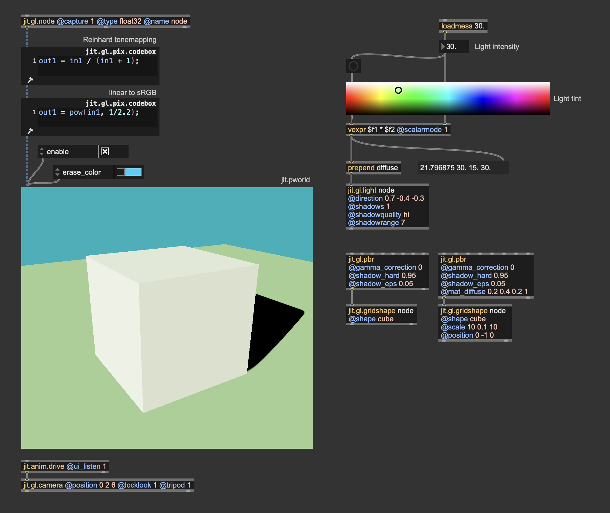
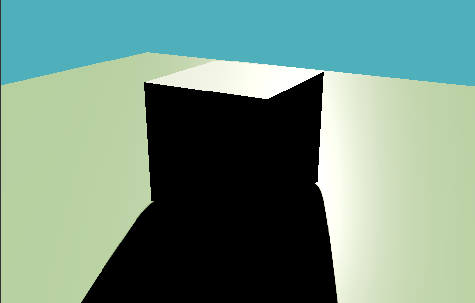
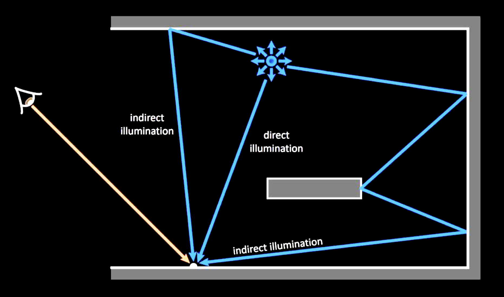
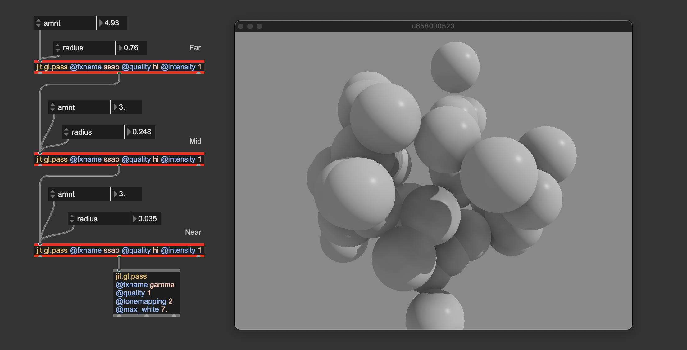
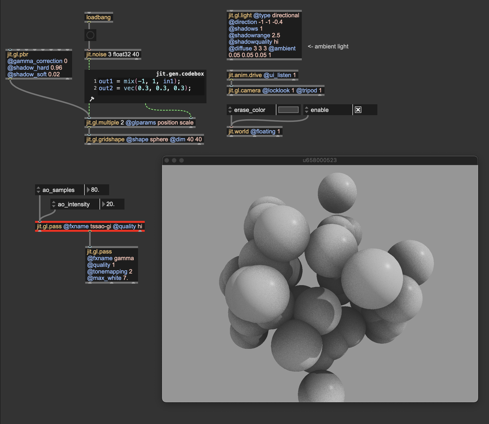

# Polish your pixels: a guide to superior renders in Jitter

# Color bit depth

In the digital domain, colors are represented using numerical values, typically in three or more dimensions. For each pixel of an image, your computer allocates a certain amount of memory to represent the color values.
***Color bit depth*** refers to the number of bits of memory used to represent the color of a single pixel and it determines the number of distinct colors values or shades that a pixel can assume:

- 1-bit: Can represent 2 values (black or white).
- 8-bit: Can represent 256 values.
- 16-bit: Can represent 65.536 values.
- 24-bit: Can represent 16777216 values.
- 32-bit: Can represent 4294967296 values.

In Jitter we can decide the color bit depth for a generated image, or we can convert the bit depth of an existing one.

For example, the object {jit.noise 3 char 100}, for each cell of the Jitter matrix, produces 3 color values using 8 bits of memory, making a 24-bit color information. Each component of the RGB encoded color can assume 256 distinct values for 16777216 possible color combinations. This is often called ***True Color***, as it’s sufficient for most applications to represent realistic images with smooth color transitions.

If 8 bits per channel (***char***) is sufficient for representing all visible colors, why do we even need higher bit depths? Let's try to apply some operations on a ***char*** Jitter matrix:

The image we get after this process should be mathematically identical to the input image ($0.2*0.2/0.04 = 1$), but you can tell they're different. This happens because although 16777216 possible color combinations are enough to represent all visible colors, the color values are truncated at each step of the process. 

To make an even more extreme example, let's assume a 1-bit color value. If such a value is $1$, and we multiply it by $0.5$ the result of this operation can't be $0.5$, but only $0$ or $1$ (depending on how the value gets rounded);

For this reason, it makes sense to have bit depths higher than 8-bit.

> [!IMPORTANT]  
> You should always use ***float32***, or at least ***float16*** matrices/textures if you're planning to process an image.

Once your process has finished, you can safely reduce the bit depth of your image if you need, for example, to use smaller storage space, and the result won't change noticeably.

# Color spaces and gamma correction

In the digital domain, colors are represented using numerical values, typically in three or more dimensions. These numerical values are then interpreted by devices like screens, printers, and cameras to produce visible colors. The most widespread color representation is RGB. As you probably already know, RGB is a color system that combines three color components (Red, Green, and Blue) to represent all the visible spectrum colors. When all are combined at full intensity, they create white light.

The problem is that the RGB color encoding is somehow abstract. Each device may have a different way of interpreting the numerical values, resulting in unconsistent results across different devices. For this reason, when we talk about colors, we usually refer to a so-called ***color space***. 

Color spaces are systems used to represent and organize colors consistently and measurably. They define how colors can be described in various contexts, whether on a screen, in print, or during digital processing. Color spaces ensure that colors appear as intended, regardless of the device.

Nowadays, most devices (TVs, phones, computer monitors, projectors) use the ***sRGB*** color space (Standard Red, Green, Blue). Understanding how sRGB works is important to assign colors to pixels properly.

## Why sRGB?

Human vision is more sensitive to changes in darker tones than in brighter tones. In other words, we can detect more subtle differences in shadowed areas than in highlights. 

Given the limited number of shades that a color may assume in the digital domain (e.g., 256 × 256 × 256 = 16.000.000 possible colors with 8-bit color data), it makes sense to "spend" more precision on darker tones than on brighter ones to match the human color perception better. If brightness were linearly represented, most of the color data would be concentrated in the bright parts of the image, and the darker parts would lack detail.

How does sRGB "distribute" precision where it's needed most? It does it by applying a so-called ***gamma correction*** curve, which re-maps the RGB values to better match human eye perception. The gamma curve in sRGB compensates for the ***non-linear*** way human eyes perceive brightness, making images appear more natural on screens; it optimizes digital data by spreading information more evenly across the range of brightness levels we perceive.

A piece-wise function defines the ***gamma correction*** curve:

The function above transforms the linear RGB colors into sRGB colors. It's also possible to convert colors back from sRGB to linear RGB:

If you want to check out an implementation of such functions, see the shader 'hdr.gamma.jxs'.

Most of the time, for efficiency and simplicity, an approiomate gamma correction function is preferred over the ones above:

- $sRGB = linRGB^{1/2.2}$
- $linRGB = sRGB^{2.2}$

These gamma correction curves are very popular and widely used in computer graphics applications because they're simpler than the original piece-wise function, and the difference is negligible.

## How and where should i apply gamma correction?

Let's put it this way: computers must operate on RGB colors. They don't care at all about our funky color perception; they just need to process color values as they are. Screens, on the other hand, are expecting to receive color values encoded in sRGB color space. So, gamma correction must always be used as the last step of any graphic pipeline. Before sending a Jitter matrix or a texture to the display, we should convert the linear RGB into sRGB.

In Jitter, this can be done in a variety of ways:

- computing gamma correction with Jitter operators

- computing gamma correction with jit.gl.pass

Gamma correction must always be the last effect before sending a matrix or a texture to the display ({jit.world}, {jit.pworld}, {jit.window}, {jit.pwindow}).

Let's now talk about the difference that it makes. Let's see the last image with and without gamma correction:

The difference is pretty dramatic; the gamma-corrected image on the left seems more natural and "believable" than the non-gamma-corrected one on the right. Dark details are more distinguishable, and it doesn't look too dark and oversaturated like the image on the right. It's not just a matter of brightness; even if increasing the color values of the image on the right to match the left image brightness, colors still look weird and unnatural:

## Gamma corrections in a chain of effects

We said that gamma correction must be applied last, but we should also convert any input image or video from sRGB to linear RGB before processing them. When images or videos are stored on your computer, their colors are in sRGB color space, therefore, to make a correct image processing chain, we must follow these steps:

- input image -> sRGB to linear RGB -> image processing -> linear RGB to sRGB -> display

Both {jit.gl.pbr} and {jit.gl.environment} have a @gamma_correction attribute, which is enabled by default. This attribute applies gamma correction at the end of the shading process.

> [!TIP]  
> This shortcut has been made to make things look better by default, but now that you know how gamma correction works, I advise you to turn @gamma_correction off and use proper color space conversions "manually." This way, any process that happens after the rendering (for example, a pass FX made with {jit.gl.pass}) will operate in the correct linear RGB color space.

Theoretically, one should convert the bricks texture from sRGB to linear RGB before using it for something. I'm not doing it because {jit.gl.pbr} internally converts the textures to the correct color space automatically. If i would have used {jit.gl.material} instead, or any custom shader that applies a texture to a mesh, i should have teaken care of converting textures to the correct color space myself.

# Light intensity and tonemapping

Let's say we want to create an outdoor scene illuminated by a bright summer sun. Let's set it up:

It's a very simple patch, but there are a couple of things i want you to focus on. First of all, I disabled @gamma_correction on both {jit.gl.pbr} objects, and I'm computing the color space conversion manually using {jit.gl.pix.codebox}. Don't mind about the other settings of {jit.gl.pbr}, we'll talk about those in another chapter. 

We said we wanted a bright, sunny day, but honestly, the result looks kind of dull and dark. I set the @diffuse attribute of {jit.gl.light} to a color that resembles the sunlight color, but it doesn't seem enough to get the effect we were after. It doesn't look like an outdoor scene because the light isn't intense enough. This brings us to a key concept: 

> [!IMPORTANT]  
> light color is NOT light intensity. 

When we set the @diffuse attribute of {jit.gl.light} what we are actually setting is the light's "tint"; if we want to have a light of arbitrary instesity, we should take those values and multiply them by an intensity value. Let's see what it looks like now:

I'm using the {swatch} object to decide the light tint, and I multiply each component of the color value by an intensity parameter. This way, the light we get resembles sunlight much more. This brings us to yet another cardinal concept: 

> [!IMPORTANT]  
> You should think in terms of light energy, not in terms of light color. 

When we set the @diffuse attribute of {jit.gl.light} we are expressing how much energy comes from the light source -> how much red, how much green, and how much blue. If you look at the values in the message box below the object {vexpr}, you can notice how values go way past 1. So, don't be afraid to crank up these numbers!

The light intensity looks correct, but we lost all the details on the shape: the image looks burnt! Let's take a look at the values that are being sent to {jit.pworld}:

I set up a little debugger utility to have a sense of what values {jit.pworld} is receiving. I'm taking the rendered image, and i'm converting the RGB values to luminance; i then compare the luminance against 1: if luminance is greater than 1, then the utility shows a white pixel, else it shows a black pixel. With this simple test, we can see that {jit.pworld} is receiving values greater than 1, and therefore all it can do is to display a white color. In other words, colors are clipped, as there's no color brighter than pure white. Once again, we're in a spot where our rendering looks unnatural: The light intensity seems convincing, but we lost all the shape details because the color values are clipped. What can we do then?

Here comes into play another essential color correction tool: ***tonemapping***.

Tonemapping is a technique used to convert high dynamic range (HDR) images with a wide range of luminance values into a format that can be displayed on low dynamic range (LDR) devices like standard monitors, televisions, or printed media. The goal of tonemapping is to compress the wide range of brightness levels in an HDR image into a range that can be properly displayed on these devices, while still conveying the perceived brightness and contrast of the original scene.

Tonemapping involves using mathematical functions or algorithms that compress the HDR luminance (brightness) range into a more limited one. This process can be done in several ways, depending on the desired artistic or visual effect. A ubiquitous tonemapping curve is the ***Reinhard Tonemapping***. This curve threatens R, G, and B channels equally and works as a sort of "intensity limiter." The Reinhard tonemapping curve corresponds to the function $RGB_{out} = \frac{RGB_{in}}{RGB_{in}+1}$, and this is its plotted graph:

The red line represents colors without tonemapping, and the green curve shows the Reinhard tonemapping function. As you can see, this function cannot grow past 1, as $\lim\limits_{x \to \infty} Reinhard(x) = 1$. Let's try then to apply this tonemapping function to our scene:

With the tonemapping function in place, the color details on the cube are back, and we can still perceive the intense brightness of the light source. Take a look at where I placed the tonemapping function in relation to the gamma correction function. The order for these two "finisher" effects matters and must always be the same:

> [!IMPORTANT]  
> Tonemapping first, then gamma correction.

What if we don't want to write the tonemapping and the gamma correction functions every time? We can again use the {jit.gl.pass} effect named ***gamma***. 

It implements both color correction curves, and you can choose between two gamma correction functions (approximate, and accurate) and among four tonemapping curves (Reinhard, Renhard-Jodie, ACES, and Uncharted2). I invite you to experiment with these functions and find the one that looks better for your scene.

# Global illumination

Let's keep working on our outdoor scene, and let's see what is still missing. Now we have a bright light illuminating the scene, but if you turn the camera around, this is what the back of the cube looks like:

The cube casts a long black shadow that, once again, looks somewhat "unnatural". If the image still doesn't "look quite right", it is because we're not considering all the lighting phenomena that may contribute to the illumination of our scene. Before getting to the details, take a look at this comparison:

On the left, we have our scene as rendered right now; on the right, there's the same scene rendered considering a wider range of lighting interactions. The image on the right looks undoubtedly more "plausible," but what are such missing lighting interactions? To give you a solid answer to this question, we have to go a step deeper into understanding how light interacts with physical objects and how to render such interactions on screen.

## Surface-light interactions

When light illuminates a surface, a variety of physical interactions occur between the light (electromagnetic radiation) and the material. These interactions determine how we perceive the surface's color, brightness, and overall appearance. Depending on the surface's properties, the light striking the surface can be absorbed, reflected, refracted, or transmitted. 

These surface-light interactions may coexist and depend on the properties of the material of which the surface is composed. For example, a black wall tends to absorb most of the light it receives; a window lets you see through it because it can transmit light, and a mirror reflects all the received light in the specular direction.
The so-called ***BRDF*** (Bidirectional Reflectance Distribution Function) describes these complex light-surface interactions.
A BRDF describes how light reflects off a surface, defining the relationship between incoming light (from a given direction) and outgoing reflected light (in another direction). 

The object {jit.gl.pbr} (Physics-Based Render) uses BRDF functions to reproduce different materials' appearance under various lighting conditions. If {jit.gl.pbr} is already accounting for generating plausible surface-light interactions, why doesn't our 3D scene look correct? 

When a surface is illuminated, part of the light is reflected into the environment. The BRDF of the material describes how such reflections behave, but the amount of light emitted back into the scene should contribute to the illumination of other surfaces. {jit.gl.pbr} applies the correct light-surface response only for the light coming directly from the light source (***direct illumination***) but doesn't account for the amount of light coming from other obects' reflections (***indirect illumination***).

Image from: "Modern Game Engine - Theory and Practice"

> [!NOTE]
> If you come from the audio realm, you can compare direct and indirect illumination to what happens when sound waves propagate in a room. The direct component is the sound coming directly from the sound source to the listener along the shortest possible path; the indirect components are the sound waves reaching the listener after a certain number of bounces off the room's walls, floor, and ceiling.

In real-world lighting, direct and indirect illumination combine to produce the complex lighting effects we experience. If we compare again the two cubes side-by-side, we can see the impact of adding indirect illumination to the scene.

The light bouncing off the floor illuminates the faces of the cube not reached by direct illumination, and the light bouncing off the cube illuminates the shadowed floor. 

How can we then compute direct and indirect illumination?

## The rendering equation

In 1986, James Kajiya introduced a mathematical formulation used in computer graphics to describe how light interacts with surfaces to produce the color and brightness we perceive. This formulation goes under the name of the ***rendering equation***:

$L_o(\mathbf{x}, \omega_o) = L_e(\mathbf{x}, \omega_o) + \int_{H^{2}} f_r(\mathbf{x}, \omega_o, \omega_i) L_i(\mathbf{x}, \omega_i) \cos(\theta) d\omega_i$

> [!NOTE]  
> Many possible formulations exist for the rendering equation, but for the sake of this article, I'll just focus on the version for non-translucent materials.

If we go beyond the initial aversion to Greek letters one may have, we can break this function into pieces and discover that it's actually pretty simple and elegant.

The rendering equation describes how much light is visible from a point on a surface $\mathbf{x}$ looking in a specific direction $\omega_o$. In other words, it can tell us the perceived color and brightness for every point on a surface. The amount of light depends on a few things, but let's focus on them individually.

The first thing that contributes to the result of the rendering equation is the amount of light the object emits (emitted radiance). If you look right at a light bulb switched on, it emits some light; the emitted radiance corresponds to the term $L_e(\mathbf{x}, \omega_o)$ in the rendering equation and refers to the amount of light that point $\mathbf{x}$ is producing in direction $\omega_o$. If point $\mathbf{x}$ sits on a non-emissive surface, $L_e(\mathbf{x}, \omega_o) = 0$. 

The rest of the equation describes how much light comes from point $\mathbf{x}$ (outgoing radiance) as a function of the light that points $\mathbf{x}$ is receiving (incoming radiance). We said before that when a surface is illuminated by some light, a variety of physical interactions may occur. As a direct result of such interactions, a certain amount of light that point $\mathbf{x}$ is receiving can be reflected in the $\omega_o$ direction and, therefore, reach the viewer or another surface, contributing to its illumination. This last bit of the function is an integral because to know how much light is reflected in the $\omega_o$ direction, we should consider all the possible directions from which the point $\mathbf{x}$ can be illuminated. Such a set of directions is infinite, and it includes all the directions within a hemisphere oriented according to the surface's normal vector. 

Image from "Voxel Based Indirect Illumination using Spherical Harmonics" by Randall Rauwendaal

The integral returns the sum of infinite light contributions coming from all directions within the normal-oriented hemisphere. Each light contribution depends on three things:

- The BRDF at point $\mathbf{x}$: $f_r(\mathbf{x}, \omega_o, \omega_i)$
- The amount of incoming radiance from direction $\omega_i$: $L_i(\mathbf{x}, \omega_i)$
- The cosine of the angle $\theta$ formed by the incoming radiance direction $\omega_i$ and the normal vector of $\mathbf{x}$: $\cos(\theta)$

So, we have it! We have the "magic" formula to compute how to color our screens' pixels precisely. There's just a little problem...computers don't like to perform an infinite number of operations! Although elegant and relatively simple, the rendering equation contains an integral, which is an endless sum of "things." If we have to implement such an uncomputable task, we would need infinite time or infinite memory available. But there is still something we can try to do. What if we don't look for the exact result of the rendering equation but rather approximate it? It turned out that instead of computing the light contributions coming from the infinite set of directions, you can perform a sum of the light contributions coming from a finite subset of directions. Accepting an approximated result makes the rendering equation computable; we can get close to the real answer if we consider enough incoming light directions. The more directions we evaluate, the closer we get to the actual result.

There's a rendering technique called ***Path Tracing*** which produces an approximate result of the rendering equation by making the number of incoming light directions finite. Such a technique is used to synthesize photo-realistic images:

These are couple of images rendered using a path tracer implemented in Max. 

> [!NOTE]  
> There isn't a ready-to-go implementation of such a rendering technique, but you can make your own path tracer by writing custom shaders. Implementing a path tracer from scratch isn't a trivial task and it's outside the scope of this article, but it goes to show you that everything is possible in Max, even if there's no object supporting a desired functionality directly (Turing complete, baby!).

There's still one major problem: finding a good approximation of the solution to the rendering equation requires a lot of time. These images were rendered in about five minutes each. While it may not seem like a lot, it is if we want to render these complex lighting phenomena in real-time, where we just have a few milliseconds of "time budget" to spend on a video frame. Techniques like path tracing are (partially) out of the way if we want to program a real-time application, but there are many variations of the rendering equation that we can use to perform complex shading in the real-time domain.

Let's see some of these techniques, and let's explore which objects implement them.

## Ambient occlusion

Ambient occlusion is a method for rendering indirect illumination based on a series of simplifications of the rendering equation. Let's assume that every point in our scene is receiving the same amount of light everywhere, that there are no emissive objects, and that we ignore the materials' BRDFs; the rendering equation simplifies to:

$L_o(\mathbf{x}) = \int_{H^{2}} L_{ambient} \cos(\theta) d\omega_i$

$L_{ambient}$ is the so-called ***ambient light***, a constant and uniform light that comes from every direction and which can potentially reach and illuminate any point in the scene. While this may sound like a very crude approximation of the lighting phenomenon, it's actually not too far from the truth: after multiple bounces off surfaces, indirect light looks like a sort or "light reverb", which tends to stabilize around an average value.

The rendering equation looks much simpler now, but we can rework it even further:

$L_o(\mathbf{x}) = L_{ambient} \sum_{i=1}^{n} \cos(\theta)/n$

The integral has been substituted with a computable dicrete summation, and the ambient term $L_{ambient}$ has been moved outside the summation since it's always the same for any incoming light direction. We assumed that the ambient light is uniform and coming from every direction within the normal-oriented hemisphere; we can, thereore, get rid of the geometric term $\cos(\theta)$ and substitute it with a simpler ***occlusion term***: 

$L_o(\mathbf{x}) = L_{ambient} \sum_{i=1}^{n} O(\mathbf{x}, \omega_i)/n$

The occlusion term is the result of the function $O(\mathbf{x}, \omega_i)$ which returns the value 1 if there's no occluding object looking from position $\mathbf{x}$ in direction $\omega_i$, and 0 if there's something blocking the ambient light in the $\omega_i$ direction.

In practice, this means for every point $\mathbf{x}$ to explore $n$ directions within the hemisphere and count how many of them are occluded

Image from "Scalable Ambient Occlusion for Molecular Visualisation", by Gary Mcgowan et al.

Since the occlusion term is divided by $n$, we are actually computing the average occlusion for point $\mathbf{x}$, which is nothing more than a value in the range [0; 1] that represents how much "stuff" is blocking the light reaching point $\mathbf{x}$.

This is what the occlusion term looks like:

Occlusion term rendered using the pass FX "tssao-gi"

It always impresses me how good the occlusion term looks on its own; it really gives the sense of how much indirect light contributes to the perceprion of objects' volume and distance between each other. 

And this is how ambient occlusion changes the look of a scene:

Left: direct light only ({jit.gl.pbr} + {jit.gl.light}); middle: direct light + uniform ambient light; right: direct light + occluded ambient light

Now that we have a good idea of what ambient occlusion is, let's see which Max objects we can use to implement it. There are three ways for adding ambient acclusion to your rendering, and they take the form of three distinct {jit.gl.pass} FXs:
- ***ssao***
- ***tssao-gi***
- ***tssao-gi-ssr***

### ssao

{jit.gl.pass}' FX ***ssao*** is the simplest ambient occlusion implementation available in max. It is controlled by three parameters: amnt, intensity, and radius. I personally like to leave "intensity" at 1, and play around with the other two parameters, but i invite you to explore the settings further. "Amnt" controls the amount of obscurance, and radius sets the distance within which to search for occluders. Although simple, ssao is my first choice, because it's not demanding in terms of computing resources, and with a little bit of tweaking, it can make miracles. 

> [!TIP]  
> Try to cascade three ssao FXs with decreasing radius. I personally find this configuration to be the best, as it delivers near-surface details, but it reacts to distant occluders too.

The name of the effect is an acronym standing for Screen-Space Ambient Occlusion, which is the technique used to explore the vicinity of each pixel in search for potential occluders.

### tssao-gi and tssao-gi-ssr

If computing power isn't an issue, you can use the {jit.gl.pass} FXs tssao-gi and its "expanded" version tssao-gi-ssr. Although different at implementation level from ssao, these two FXs compute ambient occlusion following the same criterion. The main difference is that tssao-gi and tssao-gi-ssr gather the color of the occluding objects, better approximating the indirect light components.

You can notice how the red sphere reflects some light onto the white shpere, and that the floor illuminates both spheres from below. The tssao-gi-ssr variation adds reflections to the result; in a separate step, the FX assumes a specular BRDF for the objects in the scene and computes the amount of reflected color. 

These two pass FXs can get a little closer the to original rendering equation formulation, but there're still many aspects of it left off (e.g. albedo modulation, and different BRDFs).

Before moving on, i'd like to spend a couple of words on how to set up the ambient light values for {jit.gl.light}. At each bounce, light looses some energy because part of it gets absorbed (the amount of absorpion depends on the albedo values of the surface it bounced off). After a few reflections (like 7 or 8), radiance tipically becomes very weak, to the point of being negligiable in terms of lighting contribution. Since the ambient light should represent the average indirect light amount, its values are usually set quite low (in the examples above, R: 0.05, G: 0.05, B: 0.05). That is to say to not be afraid of using just a touch of ambient light. 

> [!TIP]
> My advise is to set the ambient light to 0 and slowly fade it in until it looks right.

## ReSTIR

Image rendered using {jit.gl.pass} @fxname gi. Left: direct illumination only ({jit.gl.pbr} + {jit.gl.light}); right: direct illumination + indirect illumination

ReSTIR (short for Reservoir-based Spatio-Temporal Importance Resampling) is an advanced algorithm developed to improve real-time global illumination and rendering quality. One of ReSTIR’s strengths is its capability to compute global illumination effects like shadows, reflections, and light bouncing in real-time. Traditional path tracing, which is used for high-quality rendering, typically requires a lot of samples to resolve these details and is computationally expensive. ReSTIR reduces the need for such high sample counts, making real-time ray tracing more feasible.

# Environment mapping
# Lighting setup
# Shadows
# Antialiasing
# Give a sense of scale
# Driving viewer's attention
# Color harmony
# Image composition
