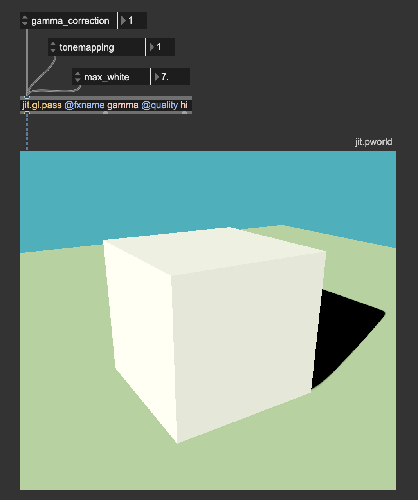
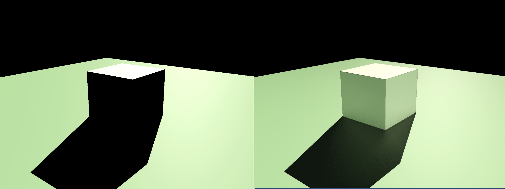

# How to improve the visual quality of your rendering in Jitter

# Color bit depth

In the digital domain, colors are represented using numerical values, typically in three or more dimensions. For each pixel of an image, your computer allocates a certain amount of memory to represent the color values.
***Color bit depth*** refers to the number of bits of memory used to represent the color of a single pixel and it determines the number of distinct colors values or shades that a pixel can assume:

- 1-bit: Can represent 2 values (black or white).
- 8-bit: Can represent 256 values.
- 16-bit: Can represent 65.536 values.
- 24-bit: Can represent 16777216 values.
- 32-bit: Can represent 4294967296 values.

In Jitter we can decide the color bit depth for a generated image, or we can convert the bit depth of an existing one.

For example, the object {jit.noise 3 char 100}, for each cell of the Jitter matrix, produces 3 color values using 8-bits of memory, hence producing a 24-bit color information. Each component of the RGB encoded color can assume 256 distinct values, for a total of 16777216 possible color combinations. This is often called ***True Color***, as it’s sufficient for most applications to represent realistic images with smooth color transitions.

If 8-bits per channel (***char***) are sufficient for representing all visible colors, why do we even need higher bit depths? Let's try to apply some operations on a ***char*** Jitter matrix:

The image we get after this process should be mathematically identical to the input image ($0.2*0.2/0.04 = 1$), but you can tell they're totally different. This happens because although 16777216 possible color combinations are enough for representing all visible colors, at each step of the process, the color values are truncated. 

To make an even more extreme example, let's assume a 1-bit color value. If such a value is $1$, and we multiply it by $0.5$ the result of this opertaion can't be $0.5$, but only $0$ or $1$ (depending on how the value gets rounded);

For this reason, it makes sense to have bit depths higher than 8-bit, and you should always use ***float32***, or at least ***float16*** matrices/textures if you're planning to process an image.

Once your process has finished, you can safetely reduce the bit depth of your image if you need, for example, to use smaller storage space, and the result won't change noticebly.

# Color spaces and gamma correction

In the digital domain, colors are represented using numerical values, typically in three or more dimensions. These numerical values are then interpreted by devices like screens, printers, and cameras to produce visible colors. The most widespread color representation is RGB. As you probably already know, RGB is a color system that combines three color components (Red, Green, Blue) to represent all the colors of the visible spectrum. When all are combined at full intensity, they create white light.

The problem is that the RGB color encoding is somehow abstract, because each device may have a different way of interpreting the numerical values, resulting in unconsistent results across different devices. For this reason, when we talk about colors, we usualy refer to a so called ***color space***. 

Color spaces are systems used to represent and organize colors in a consistent and measurable way. They define how colors can be represented in various contexts, whether on a screen, in print, or during digital processing. Color spaces ensure that colors appear as intended, regardless of the device.

Nowdays, most devices (TV, phones, computer monitors, projectors) use the ***sRGB*** color space (Standard Red Green Blue). It is important to understand how sRGB works to assign colors to our pixels properly.

## Why sRGB?

Human vision is more sensitive to changes in darker tones than in brighter tones. In other words, we can detect more subtle differences in shadowed areas than in highlights. 

Given the limited number of shades that a color may assume in the digital domain (e.g. 256 × 256 × 256 = 16.000.000 possible colors with 8-bit color data), it makes sense to "spend" more precision towards darker tones, than towards brighter ones, so to better match the human color perception. If brightness were linearly represented, most of the color data would be concentrated in the bright parts of the image, and the darker parts would lack detail.

How does sRGB "distribute" precision where it's more needed? It does it by applying a so called ***gamma correction*** curve, which re-maps the RGB values to better match the human eye perception. The gamma curve in sRGB compensates for the ***non-linear*** way in which human eyes perceive brightness, making images appear more natural on screens; it optimizes the use of digital data by spreading information more evenly across the range of brightness levels we perceive.

The ***gamma correction*** curve is defined by a piece-wise function:

The function above transforms the linear RGB colors into sRGB color. It's also possible to convert colors back from sRGB to linear RGB:

If you want to check out an implementation of such functions, see the shader 'hdr.gamma.jxs'.

Most of the times, for efficiency and simplicity, an apprixomate gamma correction function is preferred over the ones above:

- $sRGB = linRGB^{1/2.2}$
- $linRGB = sRGB^{2.2}$

These gamma correction curves are very popular and widely used in many computer graphics applications, because they're simpler than the original piece-wise function and the difference is quite negligable.

## How and where should i apply gamma correction?

Let's put it this way: computers need to operate on RGB colors. They don't care at all about our funky color perception, but they just need to process color values as they are. Screens, on the contrary, are expecting to receive color values encoded in sRGB color space. So, gamma correction must always be used as the last step of any graphic pipeline. Just before sending a Jitter matrix or a texture to the display, we should convert the linear RGB into sRGB.

In Jitter, this can be done in a variety of ways:

- computing gamma correction with Jitter operators

- computing gamma correction with jit.gl.pass

Gamma correction must always be the last effect before sending a matrix or a texture to the display ({jit.world}, {jit.pworld}, {jit.window}, {jit.pwindow}).

Let's now talk about the difference that it makes. Let's see the last image with and without gamma correction:

The difference is pretty dramatic; the gamma corrected image on the left seems more natural and "belivable" than the non-gamma corrected one on the right. Dark details are more distinguishable, and it doesn't look too dark and oversaturated like the image on the right. It's not just a matter of brightness; even if increasing the color values of the image on the right to match the left image brightness, colors look still weird and unnatural:

## Gamma corrections in a chain of effects

We said that gamma correction must be applied last, but we should also take care of converting any input image or video from sRGB to linear RGB before applying any processing to them. When images or videos are stored on your computer, their colors are in sRGB color space, therefore, to make a correct image processing chain we must follow these steps:

- input image -> sRGB to linear RGB -> image processing -> linear RGB to sRGB -> display

A quick note: both {jit.gl.pbr} and {jit.gl.environment} have a @gamma_correction attribute, which is enabled by default. This attribute applies gamma correction at the end of the shading process. This is a sort of shortcut that has been made to make things look better by default, but now that you're aware of how gamma correction works, my advise is to turn @gamma_correction off, and use proper color space conversions "manually". This way, any process that happens after the rendering (for example a pass FX made with {jit.gl.pass}) will operate in the correct linear RGB color space.

In theory one should convert the bricks texture from sRGB to linear RGB prior to using it for something. I'm not doing it because {jit.gl.pbr} internally converts the textures to the correct color space automatically. If i would have used {jit.gl.material} instead, or any custom shader that applies a texture to a mesh, i should have teaken care of converting textures to the correct color space myself.

# Light intensity and tonemapping

Let's say we want to create an outdoor scene illuminated by a bright summer sun. Let's set it up:

It's a very simple patch, but there are a couple of things i want you to focus on. First of all, i disabled @gamma_correction on both {jit.gl.pbr} objects, and i'm computing the color space conversion manually using {jit.gl.pix.codebox}. Don't mind about the other settings of {jit.gl.pbr}, we'll talk about those in another chapter. 

We said we wanted a bright sunny day, but honestly the result looks kind of dull and dark. I set the @diffuse attribute of {jit.gl.light} to a color that resembles the sun light color, but it doesn't seem enough to get the effect we were after. The main reason why it doesn't look like an outdoor scene is that the light isn't intense enought. This brings us to a key concept: ***light color is NOT light intesity***. When we set the @diffuse attribute of {jit.gl.light} what we are actually setting is the light's "tint"; if we want to have a light of arbitrary instesity, we should take those values and multiply them by an intensity value. Let's see how it looks like now:

I'm using the {swatch} object to decide the light tint and i multiply each component of the color value by an intenisty parameter. This way, the light we get resembles sun light much more. This brings us to yet another cardinal concept: ***you should think in terms of light energy, not in terms of light color***. When we set the @diffuse attribute of {jit.gl.light} we are actually expressing how much energy comes from the light source -> how much red, how much green, and how much blue. If you take a look at the values in the message box below the object {vexpr}, you can notice how values go way past 1. So, don't be afraid to crank up these numbers!

Now the light looks correct, but we lost all the details of the shape: the image looks burnt! Let's take a look at the values that are being sent to {jit.pworld}:

I set up a little debugger utility to have a sense of what values {jit.pworld} is receiving. I'm taking the rendered image, and i'm converting the RGB values to luminance; i then compare the luminance against 1: if luminance is greater than 1, then show a white pixel, else show a black pixel. With this simple test, we can see that {jit.pworld} is receiving values greater than 1, and therefore all it can do is to display a white color. In other words, colors are clipped, as there's no color brighter than pure white. Once again we're in a spot where our rendering looks unnatural: The light intensity seems convincing, but we lost all the details of the shape because the color values are clipped. What can we do then?

Here comes into play another very important color correction tool: ***tonemapping***.

Tonemapping is a technique used to convert high dynamic range (HDR) images, which have a wide range of luminance values, into a format that can be displayed on low dynamic range (LDR) devices like standard monitors, televisions, or printed media. The goal of tonemapping is to compress the wide range of brightness levels in an HDR image into a range that can be properly displayed on these devices, while still conveying the perceived brightness and contrast of the original scene.

Tonemapping involves using mathematical functions or algorithms that compress the HDR luminance (brightness) range into a more limited one. This process can be done in several ways, depending on the desired artistic or visual effect. A very common tonemapping curve is the ***Reinhard Tonemapping***. This curve threats R, G, and B channels equally, and works as a sort of "intensity limiter". The Reinhard tonemapping curve corresponds to the function $RGB_{out} = \frac{RGB_{in}}{RGB_{in}+1}$, and this is its plotted graph:

The red line represents colors without tonemapping, and the green curve shows the Reinhard tonemapping function. As you can see, this function cannot grow past 1, as $\lim\limits_{x \to \infty} Reinhard(x) = 1$. Let's try then to apply this tonemapping frunction to our scene:

With the tonemapping function in place, the color details on the cube are back, and we can percieve the intense brightness of the light source. Take a look at where i placed the tonemapping function. The order for these two "finisher" effects matters and must be always the same: ***tonemapping first, then gamma correction***.

What if we don't want to write the tonemapping and the gamma correction functions every time? There's a {jit.gl.pass} effect named ***gamma***. 

It implements both color correction curves, and you can choose between two gamma correction functions (approximate, and accurate) and among four tonemapping curves (Reinhard, Renhard-Jodie, ACES, and Uncharted2). I invite you to experiment with these functions and find the one that looks better for your scene.

# Global illumination

Let's keep working on our outdoor scene, and let's see what is still missing. Now we have a bright light illuminating the scene, but if you turn the camera around, this is what the back of the cube looks like:

The cube casts a long black shadow that, once again, looks too dark to be belivable. Let's try to understand why such a dark shadow doesn't look right.

When a light illuminates a surface, a variety of physical interactions occur between the light (electromagnetic radiation) and the material. These interactions determine how we perceive the surface's color, brightness, and overall appearance. The light striking the surface can be absorbed, reflected, refracted, or even transmitted, depending on the surface's properties. There are two primary types of illumination involved: ***direct illumination*** and ***indirect illumination***.

- ***Direct illumination*** refers to light that reaches a surface directly from a light source. It is the most straightforward form of illumination and typically produces strong, well-defined shadows and high contrast between light and dark areas.
- ***Indirect illumination*** (also called diffuse, or global illumination) occurs when light bounces off one or more surfaces before reaching the object being illuminated. This bounced or scattered light leads to softer, more even lighting that illuminates objects from multiple angles.

In real-world lighting, both direct and indirect illumination combine to produce the complex lighting effects we experience. This is the difference that indirect illumination makes on our cube:

The light bouncing off the floor illuminates the faces of the cube in shadow

$L_o(\mathbf{x}, \omega_o) = L_e(\mathbf{x}, \omega_o) + \int_{\Omega} f_r(\mathbf{x}, \omega_i, \omega_o) L_i(\mathbf{x}, \omega_i) (\omega_i \cdot \mathbf{n}) d\omega_i$

- $L_o(\mathbf{x}, \omega_o)$: Outgoing radiance at point $\mathbf{x}$ in direction $\omega_o$.
- $L_e(\mathbf{x}, \omega_o)$: Emitted radiance from the surface at $\mathbf{x}$ in direction $\omega_o$.
- $f_r(\mathbf{x}, \omega_i, \omega_o)$: Bidirectional Reflectance Distribution Function (BRDF).
- $$: Incoming radiance at point $\mathbf{x}$ in direction $\omega_i$.

# Lighting setup
# Shadows
# Antialiasing
# Give a sense of scale
# Driving viewer's attention
# Color harmony
# Image composition
