# Polish your pixels: a guide to superior renders in Jitter

Creating visually stunning renders is both an art and a science, and in Jitter, achieving top-tier results requires a blend of technical expertise and creative finesse. In the world of digital rendering, attention to detail can make all the difference between a decent image and a breathtaking one. This guide is designed to help you bridge that gap and elevate your visual output. In the following paragraphs we will explore a range of strategies, tools, and techniques to fine-tune every aspect of your render, from realistic lighting and advanced material setups to subtle post-processing enhancements. Whether you're a beginner looking to improve or an experienced user aiming to perfect your craft, this article will equip you with the insights needed to achieve high-quality renders in Jitter.

> [!NOTE]
> Some of the topics covered in this article are fairly advanced and may require a foundational understanding of Max and Jitter.

---

# Color bit depth

In the digital domain, colors are represented using numerical values, typically in three or more dimensions. For each pixel of an image, your computer allocates a certain amount of memory to represent the color values.
***Color bit depth*** refers to the number of bits of memory used to represent the color of a single pixel and it determines the number of distinct colors values or shades that a pixel can assume:

- 1-bit: Can represent 2 values (black or white).
- 8-bit: Can represent 256 values.
- 16-bit: Can represent 65.536 values.
- 24-bit: Can represent 16777216 values.
- 32-bit: Can represent 4294967296 values.

In Jitter, we can decide the color bit depth for a generated image or convert the bit depth of an existing one.

For example, the object {jit.noise} with @planecount 3, @type char, and @dim 100, for each cell of the Jitter matrix, produces 3 color values using 8 bits of memory, making a 24-bit color information. Each component of the RGB encoded color can assume 256 distinct values for 16777216 possible color combinations. This is often called ***True Color***, as it’s sufficient for most applications to represent realistic images with smooth color transitions.

If 8 bits per channel (***char***) is sufficient for representing all visible colors, why do we even need higher bit depths? Let's try to apply some operations on a ***char*** Jitter matrix:

The image we get after this process should be mathematically identical to the input image ($0.2*0.2/0.04 = 1$), but you can tell they're different. This happens because although 16777216 possible color combinations are enough to represent all visible colors, the color values are truncated at each step of the process. 

To make an even more extreme example, let's assume a 1-bit color value. If such a value is $1$, and we multiply it by $0.5$ the result of this operation can't be $0.5$, but only $0$ or $1$ (depending on how the value gets rounded);

For this reason, having bit depths higher than 8-bit makes sense.

> [!IMPORTANT]  
> You should always use ***float32***, or at least ***float16*** matrices/textures for image processing.

Once your process has finished, you can safely reduce the bit depth of your image if you need to use smaller storage space, for example, and the result won't change noticeably.

The same principles apply when capturing a render to texture: The attribute @type of {jit.gl.node} must be set to "float16" of "float32" if we want to process the images further.

Things are different when we use {jit.gl.pass}; this object is used to apply post-processing effects on a 3D scene rendered to a texture and to control the bit depth of the internal processing there's a @quality attribute: @quality "lo" = char, @quality "med" = float16" (the default), @quality "hi" = float32.

> [!IMPORTANT]  
> If multiple {jit.gl.pass} are chained and they use different @quality settings, the lowest @quality is applied to ALL the chained {jit.gl.pass} FXs. My recommendation is to set the quality to "hi" whenever possible and make sure all the {jit.gl.pass} objects in the same FX chain share the same quality settings.

---

# Color spaces and gamma correction

As we said in the previous paragraph, colors are expressed through numerical values in the digital world, often spanning three or more dimensions. Devices such as screens, printers, and cameras interpret these values to display visible colors. The RGB color model is the most commonly used representation. As you likely know, RGB stands for Red, Green, and Blue, the three primary color components combined to reproduce a wide range of colors from the visible spectrum. When all three components are combined at full intensity, they produce white light.

The problem is that the RGB color encoding is somehow abstract. Each device may interpret the numerical values differently, resulting in inconsistent results across different devices. For this reason, when we talk about colors, we usually refer to a so-called ***color space***. 

Color spaces are systems used to represent and organize colors consistently and measurably. They define how colors can be described in various contexts, whether on a screen, in print, or during digital processing. Color spaces ensure that colors appear as intended, regardless of the device.

Nowadays, most devices (TVs, phones, computer monitors, projectors) use the ***sRGB*** color space (Standard Red, Green, Blue). Understanding how sRGB works is essential to assign colors to pixels correctly.

## Why sRGB?

Human vision is more sensitive to changes in darker tones than in brighter tones. In other words, we can detect more subtle differences in shadowed areas than in highlights. 

Given the limited number of shades that a color may assume in the digital domain (e.g., 256 × 256 × 256 = 16.000.000 possible colors with 8-bit color data), it makes sense to "spend" more precision on darker tones than on brighter ones to match the human color perception better. If brightness were linearly represented, most of the color data would be concentrated in the bright parts of the image, and the darker parts would lack detail.

How does sRGB "distribute" precision where it's needed most? It applies a so-called ***gamma correction*** curve, which re-maps the RGB values to match human eye perception better. The gamma curve in sRGB compensates for the ***non-linear*** way human eyes perceive brightness, making images appear more natural on screens; it optimizes digital data by spreading information more evenly across the range of brightness levels we perceive.

A piece-wise function defines the ***gamma correction*** curve:

The function above transforms the linear RGB colors into sRGB colors. It's also possible to convert colors back from sRGB to linear RGB:

If you'd like to check out an implementation of these functions, you can see the shader 'hdr.gamma.jxs'.

Most of the time, for efficiency and simplicity, an approximate gamma correction function is preferred over the ones above:

$$
sRGB = linRGB^{1/2.2}
$$

$$
linRGB = sRGB^{2.2}
$$

These gamma correction curves are very popular and widely used in computer graphics applications because they're more straightforward than the original piece-wise function, and the difference is visually negligible.

## How and where should i apply gamma correction?

Let's put it this way: computers must operate on RGB colors. They don't care at all about our funky color perception; they need to process color values as they are. Screens, on the other hand, are expecting to receive color values encoded in sRGB color space. So, gamma correction must always be used as the last step of any graphic pipeline. Before sending a Jitter matrix or a texture to the display, we should convert the linear RGB into sRGB.

In Jitter, this can be done in a variety of ways:

- computing gamma correction with Jitter operators

- computing gamma correction with jit.gl.pass

> [!IMPORTANT]
> Gamma correction must always be the last effect before sending a matrix or a texture to the display ({jit.world}, {jit.pworld}, {jit.window}, {jit.pwindow}).

Let's now talk about the difference that it makes. Let's see the last image with and without gamma correction:

The difference is dramatic; the gamma-corrected image on the left seems more natural and "believable" than the non-gamma-corrected image on the right. Dark details are more distinguishable, and it doesn't look too dark and oversaturated like the image on the right. It's not just a matter of brightness; even if increasing the color values of the image on the right to match the left image brightness, colors still look weird and unnatural:

> [!TIP]
> As you’ve seen, gamma correction can significantly alter colors. I recommend applying gamma correction at the very start of your patching process and choosing colors based on their gamma-corrected appearance. If you apply gamma correction later and have already balanced colors without it, you may end up needing to redo the color adjustments from scratch.

## Gamma corrections in a chain of effects

We said that gamma correction must be applied last, but we should also convert any input image or video from sRGB to linear RGB before processing them. 

> [!IMPORTANT]
> When images or videos are stored on your computer, their colors are in sRGB color space; therefore, to make a correct image processing chain, we must follow these steps:
input image -> sRGB to linear RGB -> image processing -> linear RGB to sRGB -> display

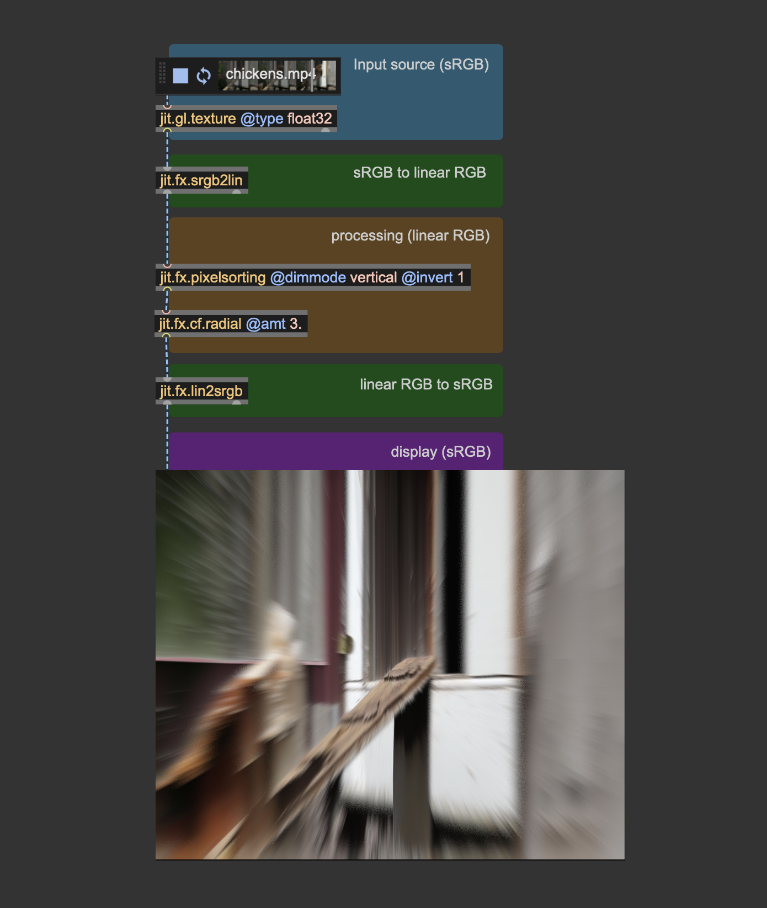

Both {jit.gl.pbr} and {jit.gl.environment} have a @gamma_correction attribute, which is enabled by default. This attribute applies gamma correction at the end of the shading process.

> [!TIP]  
> This shortcut has been made to make things look better by default, but now that you know how gamma correction works, I advise you to turn @gamma_correction off and use proper color space conversions "manually." This way, any process that happens after the rendering (for example, a pass FX made with {jit.gl.pass}) will operate in the correct linear RGB color space.

Theoretically, one should convert the bricks texture from sRGB to linear RGB before using it for something. I'm not doing it because {jit.gl.pbr} internally converts the textures to the correct color space automatically. If i would have used {jit.gl.material} instead, or any custom shader that applies a texture to a mesh, i should have teaken care of converting textures to the correct color space myself.

> [!IMPORTANT]
> Color space conversion is NOT needed in the case of simple playback and spatial resampling. Convert color spaces only if you have to work on the image's colors.

When performing a zoom operation, on the other hand, the process interpolatates pixels' color values, hence requiring a color space conversion. In practice, the difference is visually neglibigle, and the color conversion can usually be skipped. Here's a zoom-in performed with and without color space conversion; the difference is hard to tell.

---

# Light intensity and tonemapping

Let's say we want to create an outdoor scene illuminated by a bright summer sun. Let's set it up:

It's a straightforward patch, but there are a couple of things i want you to focus on. First of all, I disabled @gamma_correction on both {jit.gl.pbr} objects, and I'm computing the color space conversion manually using {jit.gl.pix.codebox}. Don't mind about the other settings of {jit.gl.pbr}, we'll talk about those in another chapter. 

We said we wanted a bright, sunny day, but honestly, the result looks kind of dull and dark. I set the @diffuse attribute of {jit.gl.light} to a color that resembles the sunlight color, but it doesn't seem enough to get the effect we were after. It doesn't look like an outdoor scene because the light isn't intense enough. This brings us to a key concept: 

> [!IMPORTANT]  
> Light color is NOT light intensity. 

When we set the @diffuse attribute of {jit.gl.light}, what we are setting is the light's emitted energy; if we want to have a light of arbitrary intensity, we should take some color values and multiply them by an intensity value. Let's see what it looks like now:

I'm using the {swatch} object to decide the light tint, and I multiply each component of the color value by an intensity parameter. This way, the light we get resembles sunlight much more. This brings us to yet another cardinal concept: 

> [!IMPORTANT]  
> You should think in terms of light energy, not in terms of light color. 

When we set the @diffuse attribute of {jit.gl.light} we are expressing how much energy comes from the light source -> how much red, how much green, and how much blue. If you look at the values in the message box below the object {vexpr}, you can notice how values go past 1. So, don't be afraid to crank these numbers up!

The light intensity looks correct, but we lost all the details on the shape: the image looks burnt! Let's take a look at the values that are being sent to {jit.pworld}:

I put together a simple utility to better understand the values that {jit.pworld} receives. This {jit.gl.pix.codebox} converts the rendered image's RGB values to luminance and then compares that luminance to 1: if it exceeds 1, the utility displays a white pixel; if not, it shows a black pixel. With this straightforward test, we can observe that {jit.pworld} is indeed receiving values greater than 1, which results in displaying only white. Essentially, this means colors are clipped, as no color can appear brighter than pure white. Once again, we're in a spot where our rendering looks unnatural: The light intensity seems convincing, but we lost all the shape details because of color clipping. What can we do then?

Here comes into play another essential color correction tool: ***tonemapping***.

Tonemapping is a technique used to convert high-dynamic-range (HDR) images with a wide range of luminance values into a format that can be displayed on low-dynamic-range (LDR) devices like standard monitors, televisions, or printed media. The goal of tonemapping is to compress the wide range of brightness levels in an HDR image into a range that can be adequately displayed on these devices while still conveying the perceived brightness and contrast of the original scene.

Tonemapping involves using mathematical functions or algorithms that compress the HDR luminance (brightness) range into a more limited one. This process can be done in several ways, depending on the desired artistic or visual effect. A ubiquitous tonemapping curve is the ***Reinhard Tonemapping***. This curve equally threatens R, G, and B channels and works as an "intensity limiter." The Reinhard tonemapping curve corresponds to the function $RGB_{out} = \frac{RGB_{in}}{RGB_{in}+1}$, and this is its plotted graph:

The red line represents colors without tonemapping, and the green curve shows the Reinhard tonemapping function. As you can see, this function cannot grow past 1, as $\lim\limits_{x \to \infty} Reinhard(x) = 1$. Let's try then to apply this tonemapping function to our scene:

With the tonemapping function in place, the color details on the cube are back, and we can still perceive the intense brightness of the light source. Look at where i placed the tonemapping function and the gamma correction function. The order for these two "finisher" effects matters and must always be the same:

> [!IMPORTANT]  
> Tonemapping first, then gamma correction.

What if we want to avoid writing the tonemapping and the gamma correction functions every time? We can again use the {jit.gl.pass} effect named ***gamma***. 

It implements both color correction curves, and you can choose between two gamma correction functions (approximate and accurate) and among four tonemapping curves (Reinhard, Renhard-Jodie, ACES, and Uncharted2). I invite you to experiment with these functions and find the one that looks better for your scene.

---

# Global illumination

Let's keep working on our outdoor scene and see what still needs to be added. Now we have a bright light illuminating the scene, but if you turn the camera around, this is what the back of the cube looks like:

The cube casts a long black shadow that, once again, looks somewhat "unnatural." If the image still doesn't "look quite right", it is because we're not considering all the entirety of lighting phenomena that contribute to the illumination of the scene. Before getting to the details, take a look at this comparison:

On the left, we have our scene as rendered right now; on the right, there's the same scene rendered, considering a more comprehensive range of lighting interactions. The image on the right looks undoubtedly more "plausible," but what are such missing lighting interactions? To give you a solid answer to this question, we have to go a step deeper into understanding how light interacts with physical objects and how to render such interactions on screen.

## Surface-light interactions

When light illuminates a surface, various physical interactions occur between the light (electromagnetic radiation) and the material. These interactions determine how we perceive the surface's color, brightness, and overall appearance. Depending on the surface's properties, the light striking the surface can be absorbed, reflected, refracted, or transmitted. 

These surface-light interactions may coexist and depend on the properties of the material of which the surface is composed. For example, a black wall tends to absorb most of the light it receives; a window lets you see through it because it can transmit light, and a mirror reflects all the received light in the specular direction.
The so-called ***BRDF*** (Bidirectional Reflectance Distribution Function) describes these complex light-surface interactions.
A BRDF describes how light reflects off a surface, defining the relationship between incoming light (from a given direction) and outgoing reflected light (in another direction). 

The object {jit.gl.pbr} (Physics-Based Render) uses BRDF functions to reproduce different materials' appearance under various lighting conditions. If {jit.gl.pbr} is already accounting for generating plausible surface-light interactions, why doesn't our 3D scene look correct? 

When a surface is illuminated, part of the light is reflected into the environment. The BRDF of the material describes how such reflections behave, but the amount of light emitted back into the scene should contribute to the illumination of other surfaces. {jit.gl.pbr} applies the correct light-surface response only for the light coming directly from the light source (***direct illumination***) but doesn't account for the amount of light coming from other objects' reflections (***indirect illumination***).

Image from: "Modern Game Engine - Theory and Practice"

> [!NOTE]
> If you come from the audio realm, you can compare direct and indirect illumination to what happens when sound waves propagate in a room. The direct component is the sound coming directly from the sound source to the listener along the shortest possible path; the indirect components are the sound waves reaching the listener after a certain number of bounces off the room's walls, floor, and ceiling.

In real-world lighting, direct and indirect illumination combine to produce the complex lighting effects we experience. If we compare again the two cubes side-by-side, we can see the impact of adding indirect illumination to the scene.

The light bouncing off the floor illuminates the faces of the cube not reached by direct illumination, and the light bouncing off the cube illuminates the shadowed floor. 

How can we then compute direct and indirect illumination?

## The rendering equation

In 1986, James Kajiya introduced a mathematical formulation used in computer graphics to describe how light interacts with surfaces to produce the color and brightness we perceive. This formulation goes under the name of the ***rendering equation***:

$$
L_o(\mathbf{x}, \omega_o) = L_e(\mathbf{x}, \omega_o) + \int_{H^{2}} f_r(\mathbf{x}, \omega_o, \omega_i) \cdot L_i(\mathbf{x}, \omega_i) \cdot \cos(\theta_i) \cdot d\omega_i
$$

> [!NOTE]  
> Many possible formulations exist for the rendering equation, but for the sake of this article, I'll just focus on the version for non-translucent materials.

If we go beyond the initial aversion to Greek letters, we can break this function into pieces and discover that it's pretty simple and elegant.

The rendering equation describes how much light is visible from a point on a surface $\mathbf{x}$ looking in a specific direction $\omega_o$. In other words, it can tell us the perceived color and brightness for every point on a surface. The amount of light depends on a few things, but let's focus on them individually.

The first thing contributing to the result of the rendering equation is the amount of light the object emits (emitted radiance). If you look right at a light bulb switched on, it emits some light; the emitted radiance corresponds to the term $L_e(\mathbf{x}, \omega_o)$ in the rendering equation and refers to the amount of light that point $\mathbf{x}$ is producing in direction $\omega_o$. If point $\mathbf{x}$ sits on a non-emissive surface, $L_e(\mathbf{x}, \omega_o) = 0$. 

The rest of the equation describes how much light comes from point $\mathbf{x}$ (outgoing radiance) as a function of the light that points $\mathbf{x}$ is receiving (incoming radiance). We said before that when some light illuminates a surface, various physical interactions may occur. As a direct result of such interactions, a certain amount of light that point $\mathbf{x}$ is receiving can be reflected in the $\omega_o$ direction and, therefore, reach the viewer or another surface, contributing to its illumination. This last bit of the function is an integral because to know how much light is reflected in the $\omega_o$ direction, we should consider all the possible directions from which the point $\mathbf{x}$ can be illuminated. Such a set of directions is infinite, and it includes all the directions within a hemisphere oriented according to the surface's normal vector. 

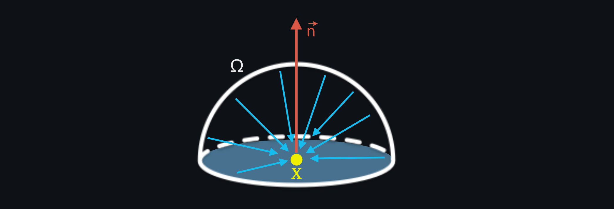
Image from "Voxel Based Indirect Illumination using Spherical Harmonics" by Randall Rauwendaal

The integral returns the sum of the infinite light contributions from all directions within the normal-oriented hemisphere. Each light contribution depends on three things:

- The BRDF at point $\mathbf{x}$: $f_r(\mathbf{x}, \omega_o, \omega_i)$
- The amount of incoming radiance from direction $\omega_i$: $L_i(\mathbf{x}, \omega_i)$
- The cosine of the angle $\theta_i$ formed by the incoming radiance direction $\omega_i$ and the normal vector of $\mathbf{x}$: $\cos(\theta_i)$

So, we have it! We have the "magic" formula to compute how to color our screens' pixels precisely. There's just a little problem...computers don't like to perform an infinite number of operations! Although elegant and relatively simple, the rendering equation contains an integral, which is an endless sum of "things." If we have to implement such an uncomputable task, we would need infinite time or infinite memory available. But there is still something we can try to do. What if we don't look for the exact result of the rendering equation but rather approximate it? Welcome the ***Monte Carlo*** method! The Monte Carlo method refers to a set of algorithms used to solve problems through statistical sampling, often in scenarios where deterministic algorithms would be too complex or inefficient. Think of trying to estimate how crowded a park is. Instead of counting every person, you take random snapshots of different spots and times. By averaging the number of people in these snapshots, you can guess how busy the park is overall. The Monte Carlo method works the same way for solving the rendering equation, just with light rays instead of people. 

We can then reformulate the rendering equation so that instead of computing the light contributions coming from the infinite set of possible light directions, it computes a sum of the light contributions coming from a finite subset of (random) directions and averages it. 

$$
L_o(\mathbf{x}, \omega_o) \approx L_e(\mathbf{x}, \omega_o) + \frac{1}{N} \sum_{i=1}^N f_s(\mathbf{x}, \omega_i, \omega_o) \cdot L_i(\mathbf{x}, \omega_i) \cdot \cos(\theta_i)
$$

Accepting an approximated result makes the rendering equation computable; if we consider enough incoming light directions, we can get close to the real answer. The more directions we evaluate, the closer we get to the result. For $N = \infty$, the solution to the discrete formulation of the rendering equation converges with the true solution.

***Path tracing*** is a rendering technique that uses the Monte Carlo method to approximate the solution of the rendering equation. This technique is commonly employed in movies and architectural visualization to create highly realistic images.

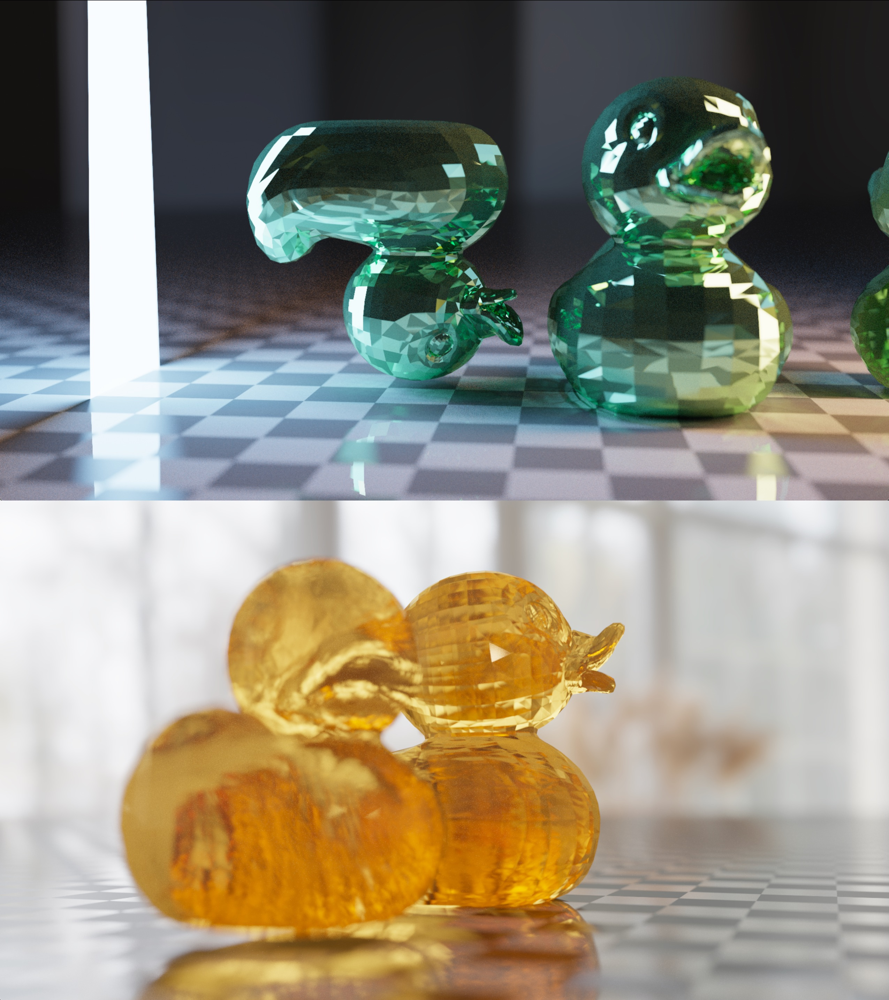

These are couple of images rendered using a path tracer implemented in Max. 

> [!NOTE]  
> There isn't a ready-to-go implementation of such a rendering technique in Max, but you can make your own path tracer by writing custom shaders. Implementing a path tracer from scratch isn't a trivial task, and it's outside the scope of this article. Still, it shows you that everything is possible in Max, even if no object directly supports a desired functionality (Turing completeness, baby!).

There's still one major problem: finding a good approximation of the solution to the rendering equation requires a lot of time. These images were rendered in about two minutes each. While it may not seem like a lot, it is if we want to render these complex lighting phenomena in real-time, where we just have a few milliseconds of "time budget" to spend on a video frame. Techniques like path tracing are (partially) out of the way if we want to program a real-time application, but we can use many variations of the rendering equation to perform complex shading in the real-time domain.

Let's see some of these techniques and explore which objects implement them.

## Ambient occlusion

Ambient occlusion is a method for rendering indirect illumination based on a series of simplifications of the rendering equation. Let's assume that every point in our scene is receiving the same amount of light everywhere, that there are no emissive objects, and that we ignore the materials' BRDFs; the rendering equation simplifies to:

$$
L_o(\mathbf{x}) = \int_{H^{2}} L_{ambient} \cdot \cos(\theta_i) \cdot d\omega_i
$$

$L_{ambient}$ is the so-called ***ambient light***, a constant and uniform light that comes from every direction and which can potentially reach and illuminate any point in the scene. While this may sound like a crude approximation of the lighting phenomenon, it's not too far from the truth: after multiple bounces off surfaces, indirect light looks like a sort of "light reverb," which tends to stabilize around an average value.

The rendering equation looks much simpler now, but we can rework it even further:

$$
L_o(\mathbf{x}) = L_{ambient} \cdot \frac{1}{n} \cdot \sum_{i=1}^{n} \cos(\theta_i)
$$

The integral has been substituted with a computable discrete summation, and the ambient term $L_{ambient}$ has been moved outside it since it's always the same for any incoming light direction. We assumed that the ambient light is uniform and coming from everywhere within the normal-oriented hemisphere; we can, therefore, get rid of the geometric term $\cos(\theta_i)$ and substitute it with a simpler ***occlusion term***: 

$$
L_o(\mathbf{x}) = L_{ambient} \cdot \frac{1}{n} \cdot \sum_{i=1}^{n} O(\mathbf{x}, \omega_i)
$$

The occlusion term is the result of the function $O(\mathbf{x}, \omega_i)$, which returns the value 1 if there's no occluding object looking from position $\mathbf{x}$ in direction $\omega_i$, and 0 if something is blocking the ambient light in the $\omega_i$ direction.

> [!NOTE]  
> In some ambient occlusion implementations, the occlusion function $O(\mathbf{x}, \omega_i)$ doesn't only return a boolean value 0 - 1, but it also reports the distance of the occluding objects.

In practice, this means for every point $\mathbf{x}$ to explore $n$ directions within the hemisphere and count how many of them are occluded.

Image from "Scalable Ambient Occlusion for Molecular Visualisation" by Gary Mcgowan et al.

Since the occlusion term is divided by $n$, we compute the average occlusion for point $\mathbf{x}$, which is nothing more than a value in the range [0; 1] that represents how much "stuff" is blocking the light reaching point $\mathbf{x}$.

This is what the occlusion term looks like:

Occlusion term rendered using the pass FX "tssao-gi."

It always impresses me how good the occlusion term looks on its own; it gives the sense of how much indirect light contributes to the perception of objects' volume and distance between each other. 

And this is how ambient occlusion changes the look of a scene:

Left: direct light only ({jit.gl.pbr} + {jit.gl.light}); middle: direct light + uniform ambient light; right: direct light + occluded ambient light

Now that we have a good idea of what ambient occlusion is, let's see which Max objects we can use to implement it. There are three ways for adding ambient occlusion to your rendering, and they take the form of three distinct {jit.gl.pass} FXs:
- ***ssao***
- ***tssao-gi***
- ***tssao-gi-ssr***

### ssao

{jit.gl.pass}' FX ***ssao*** is the most straightforward ambient occlusion implementation available in max. It is controlled by three parameters: amnt, intensity, and radius. I like to leave "intensity" at 1, and play around with the other two parameters, but i invite you to explore the settings further. "Amnt" controls the amount of obscurance, and radius sets the distance to search for occluders. Although simple, ssao is my first choice because it's not demanding in terms of computing resources, and with a bit of tweaking, it can make miracles. 

> [!TIP]  
> Try to cascade three ssao FXs with decreasing radius. I find this configuration to be the best, as it delivers near-surface details but also reacts to distant occluders.

The effect's name is an acronym for Screen-Space Ambient Occlusion, a technique for exploring the vicinity of each pixel in search of potential occluders.

### tssao-gi and tssao-gi-ssr

If computing power isn't an issue, you can use the {jit.gl.pass} FXs tssao-gi and its "expanded" version tssao-gi-ssr. Although different at the implementation level from ssao, these two FXs compute ambient occlusion following the same criterion. The main difference is that tssao-gi and tssao-gi-ssr gather the color of the occluding objects, better approximating the indirect light components.

You can notice how the red sphere reflects some light onto the white sphere and that the floor illuminates both spheres from below. The tssao-gi-ssr variation adds reflections to the result; in a separate step, the FX assumes all surfaces have the same specular BRDF and computes the amount of reflected color. 

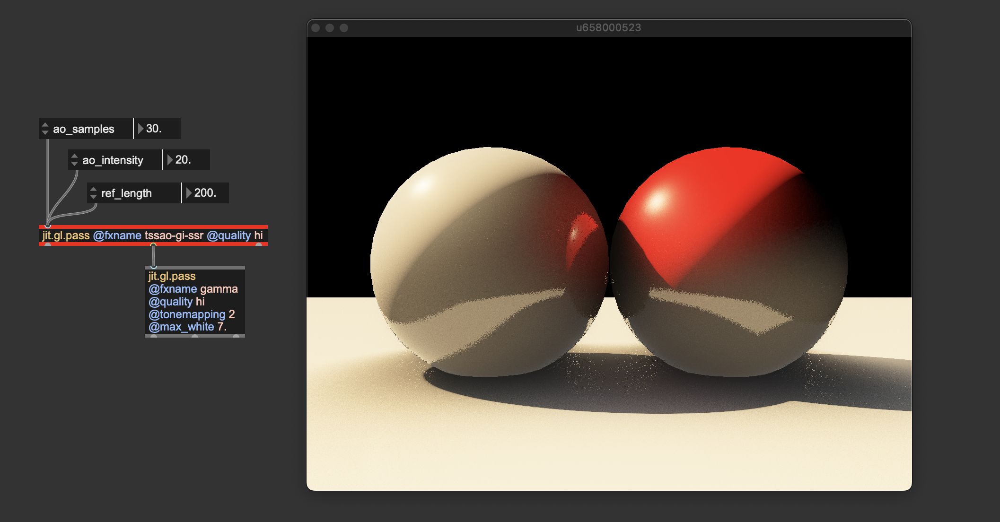

These two pass FXs can get closer to the original rendering equation formulation, but many aspects remain unconsidered (e.g., albedo modulation and per-surface BRDFs).

Before moving on, i'd like to spend a couple of words on how to set up the ambient light values for {jit.gl.light}. Light loses some energy at each bounce because part of it gets absorbed (the amount of absorption depends on the albedo values of the surface it bounced off). After a few reflections (like 7 or 8), radiance typically becomes very weak, negligible in terms of lighting contribution. Since the ambient light should represent the average indirect light amount, its values are usually relatively low (in the above examples, R: 0.05, G: 0.05, B: 0.05). That is to say, not to be afraid of using just a touch of ambient light. 

> [!TIP]
> I recommend starting with the ambient light set to 0 and gradually increasing it until you achieve the desired effect. If your scene includes a colored background (e.g., @erase_color 0.1 0.1 0.4 1.0), try matching the ambient light's tint to the background color. This approach helps create the impression that the environment is contributing to the scene's illumination. For an even spicier technique, consider using {jit.fx.an.mean} to calculate the average color of the rendered image and apply it as the ambient light.

## ReSTIR

Image rendered using {jit.gl.pass} @fxname gi. Left: direct illumination only ({jit.gl.pbr} + {jit.gl.light}); right: direct illumination + indirect illumination

ReSTIR (Reservoir-based Spatiotemporal Importance Resampling) is a cutting-edge technique in real-time computer graphics for improving lighting quality. It's especially valuable for ray-traced graphics, where simulating light behavior accurately is traditionally very demanding on computational resources. 

Let’s explore what makes ReSTIR unique without delving too deeply into technical details. When we discussed path tracing, we noted that this rendering method is slow because it requires evaluating a large number of incoming light directions to approximate the solution to the rendering equation, which makes it unsuitable for real-time applications. So, how many directions can we feasibly evaluate within the time span of a single frame on modern hardware? The answer is surprisingly limited: just one or two. Given that a typical path tracer samples around 10,000 directions, which single direction should we prioritize? Ideally, it would be the direction that carries the most energy (light), contributing the most to the pixel’s shading. But how can we identify this optimal direction? This is where ReSTIR comes into play. Think of it as a sophisticated 'direction sorter' that can quickly identify the most significant light direction—the one that maximizes energy contribution.

> [!NOTE]
> Numerous variations of the ReSTIR algorithm have been developed to adapt to different rendering pipelines. In Jitter, the ReSTIR algorithm is used to compute global illumination by tracing rays in screen-space.

ReSTIR has been implemented in Max 9 as {jit.gl.pass} FX named "gi" (global illumination). This pass FX can interact with {jit.gl.pbr} (to get the materials' BRDFs) and with {jit.gl.environment} (to gather light from an environment map). This means that whichever settings you use for jit.gl.pbr, the ReSTIR algorithm will respond with the correct lighting behavior. For example, any change of a mesh' roughness and/or metalness will affect how the "gi" pass computes global illumination.

The inner mechanics of the ReSTIR algorithm are complex, but the "gi" pass FX is relatively straightforward to use. As long as you correctly set gamma correction and tonemapping, you just need to instantiate it, and it does its job.

> [!IMPORTANT]
> The "gi" pass FX requires rendering multiple render targets (direct illumination, albedo, normals, roughness, metalness, four layers of depth). To make the effect work correctly, {jit.gl.pass}' @quality attribute must be set to "hi".

Some of the effects discussed in this chapter, particularly "tssao-gi" and "gi," compute indirect illumination by simulating the way light bounces off surfaces in the scene. The amount of light reflected back into the environment after each bounce is influenced by several factors, one of which is the albedo color—often referred to as the surface color (corresponding to the attribute @mat_diffuse in {jit.gl.pbr} and {jit.gl.material}).

The term "albedo color" can be somewhat misleading, as it might suggest it is simply a color. In reality, the albedo color determines the proportion of light that is absorbed versus reflected by a surface. For example, an albedo color of (0.9,0.1,0.1) (RGB) indicates that the object reflects nearly all energy in the red wavelength while almost completely absorbing the green and blue wavelengths.

With this in mind, it’s crucial to be careful when setting the albedo color:

> [!IMPORTANT]
> - The albedo color should not exceed a value of 1. In accordance with the principle of energy conservation, no object can reflect more light than it receives.
> - The albedo color should also avoid being exactly 0 or 1. In the physical world, no object perfectly absorbs or reflects a specific wavelength. To avoid this, steer clear of absolute values when setting albedo. For example, instead of defining a bright green surface as (0.0, 1.0, 0.0), use a value like (0.05, 0.9, 0.05). This ensures no wavelength is completely "eliminated," which is particularly important if the indirect illumination algorithm in use calculates multiple light bounces.
> - Albedo values generally do not need to be very high. Typically, albedo colors are defined with values below 0.5. If you need a brighter appearance, consider increasing the light intensity instead of pushing albedo values higher.

These are the built-in solutions for computing indirect lighting and global illumination in Max 9. However, there are other noteworthy algorithms and strategies for global illumination, such as voxel cone tracing (VCT), surfels, virtual point lights (VPL), and instant radiosity, each with its own set of pros and cons. So, which method is the best? It depends on the situation—use what works best for your needs; and if the built-in global illumination options in Max 9 don’t meet your requirements, I encourage you to implement your own using custom shaders (All the effects discussed in this article were originally prototyped with Max objects).

---

# Image-based lighting

Images rendered with various environment maps and "gi" pass FX.

One of the secrets to achieving realism is Image-Based Lighting, or IBL for short. Think of IBL as a way to light up your 3D world using real photos of an environment. Instead of manually placing lights around your scene, you can use an image, often a special panoramic photo called an environment map (a High Dynamic Range image), that captures the light and colors of a real place. This image wraps around your 3D scene like an invisible sphere, casting light and reflections as if your virtual object were truly sitting in that environment.

In Max you can upload an environment map into {jit.gl.material} or {jit.gl.pbr} directly, or use {jit.gl.environment}. The latter is designed to communicate with all {jit.gl.pbr}, {jit.gl.material}, and {jit.gl.skybox} objects in the patch. {jit.gl.environment} also interacts with the "gi" pass FX. By loading an environment map, the "gi" pass can ray trace this environment, casting light from it.

> [!TIP]
> Usually, all objects in a 3D scene are supposed to live in the same environment. For this reason, i suggest using {jit.gl.environment} for uploading an environment map, because it greatly simplifies the IBL settings control.

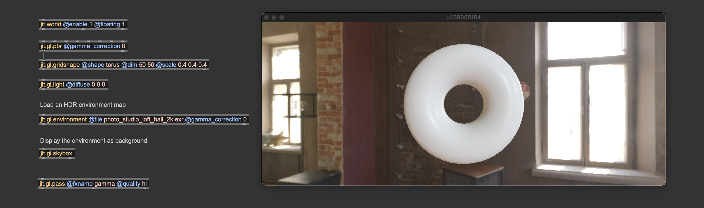

By loading different environment maps, you can quickly change the illumination of your entire scene. You can download plenty of them online or create your own with 360° cameras. Environment maps usually come in the .EXR format.

> [!NOTE]
> EXR images, or OpenEXR files, are a type of image format designed specifically for high-quality, high-dynamic-range (HDR) imaging. These images are commonly used in computer graphics and visual effects, including environment mapping, due to their ability to store a vast range of luminance and color data that traditional image formats like JPEG or PNG cannot capture.

Environment maps usually come in two formats: equirectangular and cube maps.
- An equirectangular environment map is a panoramic image representing a full 360-degree view of an environment mapped onto a 2D rectangular image. The format resembles a world map where the top and bottom portions correspond to the poles, and the center represents the equator.
A cube map is a set of six square images that represent the environment around a point in space. Each image covers one side of a cube (front, back, left, right, top, and bottom). When mapped together, these six images form a seamless 3D environment around a viewer or object.

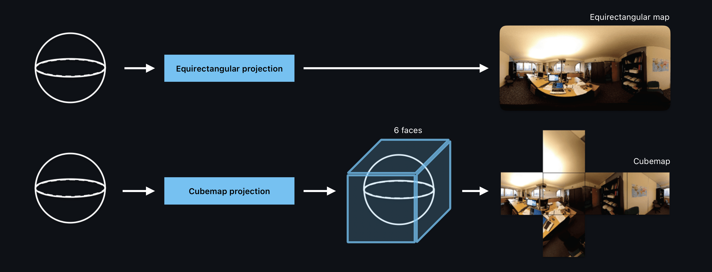

Image from "Extending 2D Saliency Models for Head Movement Prediction in 360-degree Images using CNN-based Fusion" by Ibrahim Djemai et al.

The object {jit.gl.environment} can load equirectangular environment maps. Still, if you have a cube map, you can transform it into an equirectangular map using the object {jit.gl.cubemap}.

> [!NOTE]
> Take a look at the {jit.gl.environment} help file to see how to import cube maps into it. If you need to transform an equirectangular environment map into a cube map, check out the "ibl.rect2cube.mrt.jxs" shader.

The object {jit.gl.environment} has a @gamma_correction attribute; like with {jit.gl.pbr}, if you want to manage gamma correction manually, you should disable this attribute. The {jit.gl.environment} object includes an attribute called @reflect_edge, which determines the resolution of the environment map used for reflections. This value should be set as a power of 2.

> [!TIP]
> If your scene contains very smooth materials (with @roughness close to 0), a low @reflect_edge value may result in blurry reflections. If that's the case, increase @reflect_edge to a larger power of two.

Max comes with a built-in "default" lighting setup. When you create a 3D object in an empty patch, it appears illuminated even if no {jit.gl.light} object is present. This is because Max automatically applies a white hemisphere light from above, providing a convenient way to sketch out a scene without worrying about lighting configuration. However, as soon as a {jit.gl.light} object is added, this default light is automatically turned off and replaced by the custom lighting you set up. Unlike with {jit.gl.light} objects, the default light isn’t automatically disabled when using a {jit.gl.environment}.

> [!IMPORTANT]
> If you want to use image-based lighting ONLY (without any {jit.gl.light}), you must instantiate a "dummy" light with @diffuse 0 0 0 to override the default hemisphere light.

This image should be illuminated only by the dark environment, but it doesn't work without the "dummy" black light overriding the default hemisphere light.

---

# Shadows

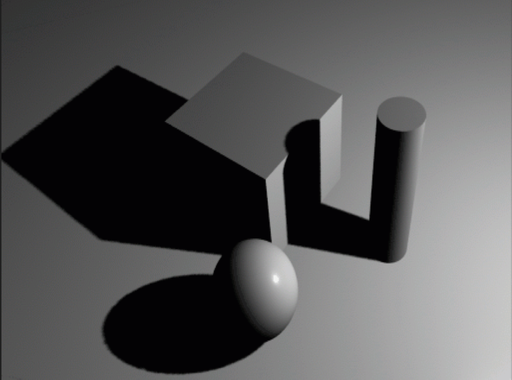

In computer graphics, shadows are visual indicators that mimic the effect of objects blocking light. They are crucial for creating realistic 3D environments as they convey the spatial relationships between objects, their positions, and their interactions with light sources. Shadows result from light being obstructed and unable to reach certain surfaces due to intervening objects. In essence, shadows are defined negatively: they represent the absence of light. The rendering equation inherently accounts for shadowing, but, as mentioned, solving it directly is impractical in real-time rendering. Therefore, specific techniques have been developed to identify which surfaces should not be illuminated. Jitter employs a method known as ***shadow mapping*** for rendering shadows.

Shadow mapping works by identifying which parts of the scene are occluded from the light source's viewpoint, thus indicating where shadows should fall. Due to its versatility, this method is highly effective and widely used in real-time rendering for applications like video games and simulations. Picture positioning a light source (e.g., {jit.gl.light}) and observing the scene from its vantage point. Surfaces visible from the light’s position receive illumination, while those not directly seen remain in shadow. 

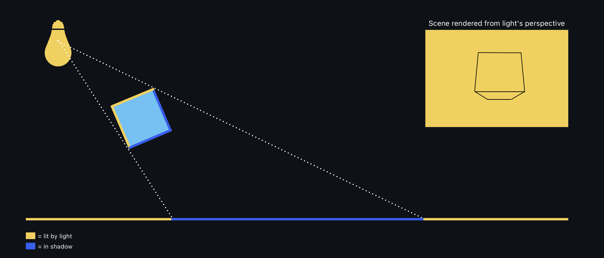

Shadow maps are created by rendering the scene from the light's point of view and recording the distance to the visible surfaces. To determine if a point visible from the camera should be in shadow, the distance from that point to the light source is calculated. If this distance is greater than the value stored in the shadow map, the point is considered in shadow.

Let's now see hot to activate shadows in Jitter.

Shadows are activated from the {jit.gl.light} object by enabling the @shadows attribute. All 3D objects connected to a {jit.gl.pbr} or {jit.gl.material} will cast and receive shadows.

> [!NOTE]
> Only directional lights and spot lights can cast shadows.

Shadows are there, but they don't look very good on this scene and would probably need some tweaking. {jit.gl.light} has some attributes we can modify related to shadows: @shadowblur, @shadowquality, @shadowrange. Let's see what are these attributes referring to:

***@shadowblur*** controls the amount of blurring applied on the rendered shadows. When the light source is very small or very far from the illuminated object, shadows appear sharp, with well-defined edges where the transition between light and shadow is abrupt. This kind of shadows are usually called ***hard shadows***. On the contrary, if the light has a big emitting surface, shadows have blurred, gradual edges, creating a transition zone between light and dark. This transition is called the penumbra, where light is partially blocked but not wholly absent. The center of the shadow, where light is entirely blocked, is called the umbra. Such blurry shadows are called ***soft shadows***. The @shadowblur attribute controls the transitions from hard to soft shadows, and it helps give the impression of a large emitting light. It also helps with masking aliasing problems (more on that later).

***@shadowquality*** is a parameter that controls the resolution of the shadow map. As said before, shadow mapping captures the scene from the camera's point of view into a texture. @shadowquality sets the overall quality of the shadow map by changing its resolution.

> [!TIP]
> When setting @shadowquality, start from "hi", and progressively reduce the quality until you see jagged shadow margins. Then, increase the quality by one step. If performance isn't an issue, go with "hi" directly.

> [!NOTE]
> Instead of using the @shadowquality attribute, you can send the message "sendoutput dim" followed by the desired shadow map size to {jit.gl.light}. Take a look at the patch 'lights.shadow.map.texture.maxpat' for an example.

The ***@shadowrange*** attribute determines how much of the scene is visible from the light's perspective. When rendering the scene from a light source, the light is represented by a virtual camera, which has the same controls as any camera created with {jit.gl.camera}. This includes a far clip parameter to set the extent of the view frustum. The @shadowrange attribute specifies the length of the light-camera frustum. Adjusting this attribute properly is essential to ensure that all objects in the scene can cast shadows.

From left to right: @shadowrange too short, correct @shadowrange, @shadowrange too long.
When @shadowrange is too small, only objects close to the light can cast shadows. When @shadowrange is too high, all objects in the scene can cast shadows, but the produced shadows lack definition.

> [!TIP]
> When setting @shadowrange, start at 0 and increase it slowly. Stop right when all objects in the scene are casting shadows.

These are the settings i ended up with:

I usually like to have shadows with no or little blur when using directional lights because they simulate light coming from a distant emitter, which doesn't create penumbra regions. @shadowrange has been set to comprise all the objects in the shadowmap tightly, and @shadowquality has been set to "hi" because performance wasn't problematic with such a simple scene.

These were the shadow settings of {jit.gl.light}, but there are other shadow-related attributes we can modify: {jit.gl.pbr} and {jit.gl.material} can in fact be used to tweak the shadow apparence further. Let's take a closer look at our scene:

You can notice that the shadow isn't precise where the cube contacts the floor. {jit.gl.pbr}'s shadow-related attributes control the behavior of the shadow-receiving objects, and we can try to tweak them to improve the shadow's look. @shadow_hard, @shadow_soft, and @shadow_radius are parameters used to trim the shadow's appearance when {jit.gl.light}'s @shadowblur is greater than 0, defining the transition between umbra and penumbra. Since our light is directional, i'll set these parameters to their "neutral" values:

You can notice that the contact shadow looks sharper now. The last attribute, @shadow_eps, is used to compensate for two kinds of visual artifacts that shadow mapping may produce: shadow acne and shadow leakage.

Shadow acne is a common artifact in shadow mapping. It creates an unwanted pattern of dark spots or lines on the surfaces of 3D objects. 

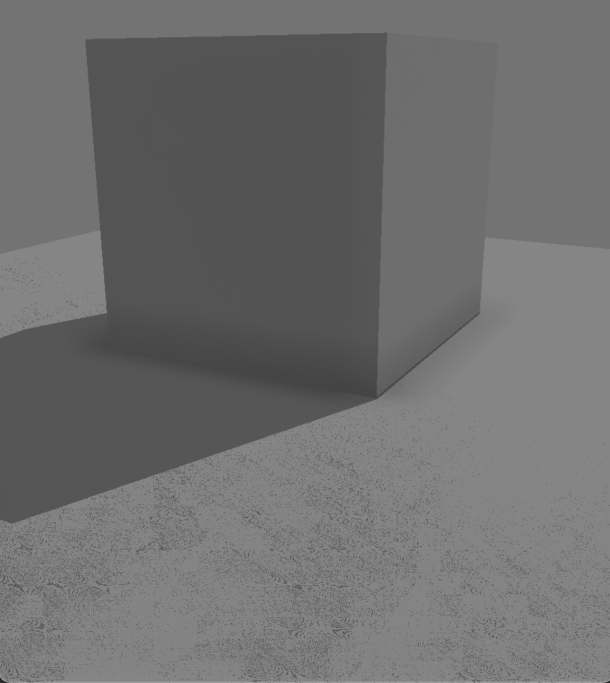

This issue happens when the shadow map incorrectly calculates whether a point is in shadow, leading to a speckled or "striped" appearance. Shadow acne arises due to precision errors and self-shadowing issues. When rendering from the light's point of view, each surface's distance from the light is stored in the shadow map. The distance from the camera's perspective is compared to the shadow map's stored values during the scene's final rendering. If the depth values are too close or nearly identical, slight precision errors can cause the surface to be falsely considered in shadow, even when it shouldn't be. This leads to shadow acne. A slight offset is added to the distance comparison to solve this issue, removing self-shading issues. @shadow_eps controls this arbitrary offset (the slight offset is usually called "epsilon").

Shadow leakage is another common artifact in shadow mapping. In this phenomenon, light or shadow unintentionally "leaks" through objects, causing parts of the scene to appear illuminated when they should be in shadow or vice versa. 

Shadow leaking below the cube.

Shadow leakage typically happens due to improper depth comparisons or insufficient precision in the shadow map, leading to errors in identifying whether a surface should be in shadow. This issue is especially common when large or complex scenes are rendered, where distant objects or parts of the scene may not be accurately represented in the shadow map. Once again, a small @shadow_eps can solve or alleviate the issue.

> [!TIP]
> When setting @shadow_eps, start at 0 and increase it slowly. Stop right when the artifacts disappear.

Left: @shadow_eps = 0, leads to shadow acne; Center: @shadow_eps 0.004, correct settings for this scene; Right: @shadow_eps = 0.2 (the default), leads to light leaking through the wall on the left, and the shadows below the poles on the balcony look detached from the poles.

At the end of the day, shadow mapping always requires some tweaking. It's impossible to find settings that always work because shadow mapping is very sensible to the scene's scale. The only way to get the desired effect is to empirically tweak the parameters until the shadows look good. Still, it's important to be aware of the parameters' role to modify them with consciousness.

As with everything in computer graphics, many variations of the original algorithm have been created. To name a few: percentage-close filtering (PCF), variance shadow maps (VSM), and cascaded shadow maps (CSM). For those of you who are into shader programming, i invite you to experiment with different shadow mapping techniques. If you need to access the shadow map captured by {jit.gl.light} for custom shadow mapping implementations, check out the patch 'lights.shadow.map.texture.maxpat'.

---

# Anti-aliasing

Imagine looking at a digital image where the edges of objects aren’t smooth but appear jagged, like tiny staircases. This is a common problem called aliasing, where visuals don’t look as smooth or realistic as we’d like because the computer struggles to represent fine details at a limited resolution. Let's break down what aliasing means, why it happens, and how to fix it in Jitter.

Aliasing happens when complex images or detailed patterns are represented at a lower resolution than needed. Picture trying to draw a smooth curve using only square blocks—no matter how carefully you place them, you’ll end up with a blocky, stepped edge instead of a perfect curve. Aliasing arises when a continuous signal (e.g., an image or sound wave) is sampled at an insufficient rate, violating the Nyquist-Shannon sampling theorem. In computer graphics, this means that when an image or 3D model is rendered at a resolution that cannot fully capture its detail, the representation suffers from noticeable artifacts.

A variety of techniques have been developed to minimize aliasing. Such techniques are grouped under the umbrella term ***anti-aliasing***.

In Jitter, there are 3 methods we can use to reduce aliasing issues.

## Full Scene Anti-Aliasing (FSAA)

Full Scene Anti-Aliasing is the simplest but the most effective form of Anti-Aliasing. FSAA solves aliasing issues by rendering the entire scene at a higher resolution than the display resolution. For example, if the target display resolution is 1080p (1920x1080 pixels), FSAA might render the scene at 2x, 4x, or even higher multiples of that resolution (e.g., 3840x2160 or 7680x4320). Once the high-resolution scene is rendered, FSAA averages the colors of the sub-pixels to compute the final color of each displayed pixel. This averaging smooths out color transitions between adjacent pixels, reducing the stair-step effect seen along diagonal and curved edges. The rendered high-resolution image is then downsampled (reduced) to the original display resolution. The result is a smoother final image that preserves the details while minimizing aliasing effects.

In Max, FSAA can be enabled by the attribute @fsaa of {jit.world}, {jit.pworld}, and {jit.gl.node}. @fsaa enables a 2x supersampling.

## Temporal Anti-Aliasing (TAA)

Temporal Anti-Aliasing (TAA) is an advanced anti-aliasing technique that reduces aliasing artifacts by using information from previous frames in addition to the current frame to produce aliasing-free images. TAA takes samples from multiple frames over time (hence "temporal") and combines them. Unlike techniques that only use information from a single frame, TAA leverages data from past and current frames to determine the color of each pixel in the current frame.
TAA applies a sub-pixel jitter or shift to the camera's position between frames. This shift allows the rendering engine to gather more unique sub-pixel data over time. The sub-pixel offsets are small and imperceptible individually, but when combined over several frames, they result in higher-quality sampling and reduce aliasing. The samples from the current frame and previous frames are blended together. The algorithm accumulates and averages these samples to compute the final color of each pixel. A history buffer is maintained to store information from past frames, allowing the TAA algorithm to look back over time and use this data in the blending process. TAA incorporates motion vectors to account for object and camera movement. These vectors help track how each pixel has moved from frame to frame, ensuring that the accumulation of data aligns correctly and doesn't cause ghosting or blurring of moving objects.

In Max, TAA can be applied using the object {jit.gl.pass} @fxname TAA.

Careful consideration must be given to the placement of Temporal Anti-Aliasing (TAA) in an effects chain. TAA relies on color information across multiple frames, and to prevent ghosting artifacts, it restricts the color of each pixel to fall within the minimum and maximum color values of its eight neighboring pixels. This process, known as color clipping, is a critical aspect of TAA.
To enhance the accuracy of color clipping, colors are first converted from RGB to the YCoCg color space. Without delving too deeply into technical details, this color space represents color using values strictly within the [0, 1] range. Consequently, it is important to ensure that TAA does not receive RGB values exceeding 1. Applying tone mapping before TAA guarantees that no values surpass this range.

> [!IMPORTANT]
> TAA must be placed after tonemapping and before gamma correction.

Left: TAA on; right: TAA off.

## Mipmapping

Imagine you’re playing a video game, and you’re looking at a wall in the distance. The wall is covered with a brick texture, and when you get closer, you can see the texture in full detail. But when you’re far away, you don’t really need that high level of detail—you just need enough texture to recognize it as a wall. This is where mipmapping comes in. Mipmapping is a clever trick used to make textures look nice (alias-free) from all distances. 

When a texture (like a brick wall) is loaded, the computer automatically makes smaller versions of it, called mipmaps. Each mipmap is a scaled-down version of the original texture.
So, if the original texture is 1024x1024 pixels, mipmaps would be created at 512x512, 256x256, 128x128, and so on, all the way down to a tiny 1x1 pixel version. When you’re far from the wall, the graphics engine will use one of the smaller mipmaps instead of the original high-resolution texture. As you get closer, it switches to larger mipmaps, and when you’re really close, it uses the full-resolution texture. This set of pre-filtered textures can reduce aliasing artifacts appearing on textured surfaces.

Mipmapping in Max is enabled at texture level: set {jit.gl.texture}'s @mipmap to "bilinear" or "trilinear" and disable @rectangle.

> [!IMPORTANT]
> {jit.gl.texture}'s @rectangle must be disabled (0) to enable mipmapping, as non-rectangular textures are required for creating the MIP levels.

Left: Mipmapping enabled; right: Mipmapping disabled.

These are the anti-aliasing methods currently available in Max. 

> [!TIP]
> Anti-Aliasing and mipmapping can coexist. I suggest always using both an Anti-Aliasing method and mipmapping combined.

Left: no Anti-Aliasing and no mipmapping. Center: mipmapping only (trilinear). Right: mipmapping (trilinear) + Anti-Aliasing (TAA).

---

# How to give a sense of scale and distance

Which of the two ducks is bigger?

They are the same size, but some visual clues make us perceive the duck on the right to be way bigger than the duck on the left. We, as humans, are used to estimate the size of objects and the distance between them. Humans estimate the size of objects through a combination of visual cues, learned experience, and context. Our brains use information from our eyes, as well as from our knowledge of the world, to interpret and understand the relative size and distance of objects. I'd like to list some visual clues that contribute to the size perception and explore how we can recreate them in Jitter to give a better sense of objects' scale.

## Familiarity and Context

This is an easy one: When we already know the typical size of an object, like a car or a person, we can estimate its size based on that knowledge. If we see something that looks like a car but appears unusually small, we might assume it’s further away.
The objects around something in a scene also give clues. For instance, if we see a person standing next to a building, we understand the scale of each object based on the scene as a whole. We can use this to our advantage, for example, inserting some familiar objects of well-known size in the scene.

On the same page, we are used to experiencing the world around us by looking from a constant height above the ground. Small objects are usually observed from above, and big ones from below.

## Atmospheric scattering

Atmospheric scattering occurs when sunlight or other light waves hit particles in the atmosphere, like dust, water droplets, and gas molecules, causing the light to scatter in different directions. This scattering effect influences how we see distant objects and is one of the main reasons why the sky looks blue during the day and sunsets look reddish.

Here's how it works: when we look at something far away—like a mountain range or a city skyline—the light bouncing off those distant objects travels through more of the atmosphere to reach our eyes. As it does, particles scatter the shorter blue and violet wavelengths, making distant objects appear hazy, less distinct, and sometimes even bluish. This haze makes distant objects seem "faded" compared to those nearby.

Atmospheric scattering also impacts our perception of distance and size. Because objects that are further away look blurrier and less vibrant, our brains interpret them as being far off, which helps us judge distance. Similarly, this effect can make faraway objects look smaller than they are because they lose clarity and detail as more of their light scatters. This natural "distance blur" adds depth to what we see and plays a significant role in creating a sense of scale in outdoor landscapes.

Take a look at the following image:

On the left, there's a scene rendered typically; on the right, atmospheric scattering was added. Look at how it's easier to perceive objects' distance and how immediately our brain thinks: "Those donuts must be huge!"

According to Beer’s Law, light intensity diminishes exponentially with distance as it travels through a medium (like the atmosphere) filled with particles that scatter or absorb it. Essentially, the farther the light travels, the weaker it is because particles absorb or scatter part of it along the way.

$$
I = I_0 \cdot e^{-\alpha x}
$$

Where:

- $I$ is the light intensity after it has traveled a certain distance $x$ through the medium.
- $I_0$ is the initial intensity of the light before it enters the medium.
- $\alpha$ is the attenuation coefficient, which depends on the properties of the medium (such as concentration and the specific absorption/scattering properties of the particles within it).
- $x$ is the path length or distance the light travels through the medium.

In Max, atmospheric scattering can be added to a scene using the {jit.gl.pass} FX named "atmospheric":

In the effect we can find as control parameters the factors of the Beer's law: @density multiplies the distance of the objects on srcreen, and @color specifies the rate of light absorption per color channel. @density and @color togheter consitute the $\alpha$ factor. The pass also contains settings to create a ground fog effect.

## Virtual camera settings

The virtual camera settings significantly impact how we perceive the distance, size, and depth of objects in a scene. Just like a real camera, virtual camera settings such as field of view (FOV), focal length, and camera position influence how objects appear in terms of size and distance. Here’s a breakdown of the main settings and how they affect perception:

### Field of View (FOV)

Field of view represents the extent of the scene that the camera can "see" and is typically measured in degrees. It’s essentially the camera's angle of view. A wide field of view (e.g., above 60°) creates a more dramatic sense of depth but can distort objects at the edges, making close objects appear larger and distant objects smaller. This can exaggerate the sense of distance and make the scene feel expansive. A narrow field of view (e.g., below 30°) does the opposite, compressing the perceived space and making objects seem closer together, often giving a "zoomed-in" effect. In Max, you can set FOV using the @camera_angle attribute of {jit.gl.camera}.

### Camera Position and Orientation

This refers to where the virtual camera is placed within the scene and the angle at which it points.
Camera height, distance from objects, and the viewing angle can greatly influence perceived size and distance. For example:
Low camera angles make objects appear larger and more imposing, especially when looking up at them.
High camera angles create a "bird's-eye view" effect, making objects appear smaller and sometimes less significant.

### Depth of Field (DOF)

Depth of field (DOF) determines how much of the scene is in focus. A shallow DOF (where only a small part of the scene is sharply in focus) draws attention to a specific area, often creating a strong sense of foreground and background separation.
A shallow depth of field can make objects outside the focal area look blurrier, enhancing the perception of depth and making the in-focus subject appear isolated or more distant from the rest of the scene. A deep depth of field, where everything is in focus, can flatten the scene slightly, as all objects appear equally sharp regardless of distance.

Im Max, you can create a depth of field effect using {jit.gl.pass} @fxname "dof-hq". This effect replicates the behavior of a real camera.

The "dof-hq" pass is controlled by many parameters, but the main two are:

- @lens_focal_length: The focal length of a camera is a fundamental optical property that defines how zoomed-in or zoomed-out an image appears. It’s typically measured in millimeters (mm) and describes the distance between the camera lens and its sensor or film when the lens is focused on a subject at infinity. In the context of DOF, the focal length affects the amount of depth blur; Shorter focal lengths tend to have a larger depth of field, keeping more of the scene in focus from front to back, which is helpful in capturing detailed landscapes. Longer focal lengths have a shallower depth of field, especially at wide apertures, which isolates subjects by keeping them sharp while blurring the background—ideal for portrait photography.

@lens_focal_distance: Focal distance is the distance between the camera's lens and the point in the scene where objects appear sharp and in focus. This is different from focal length, which refers to the optical property of the lens itself. Use this attribute to decide which part of the scene must stand out and catch the viewer's attention.

> [!TIP]
> I suggest activating the attribute @show_in_focus to set "blur-hq" params precisely. The brighter the color, the sharper the image looks, and the red area shows which part of the scene is perfectly in focus. 

---

# How to enhance object movement

In computer graphics, making objects move according to real-world physical laws is essential for creating believable and immersive scenes. When objects behave as they would in nature—accelerating, slowing down, bouncing, or falling realistically—our brains recognize and connect with that authenticity, making the scene feel much more lifelike. By applying principles like inertia, gravity, and friction, you can achieve motion that looks correct and helps the audience engage with the virtual world as if it were real. This adherence to physical laws bridges the gap between digital environments and our physical understanding, enhancing both visual realism and emotional impact.

Let's see how we can improve the movement of objects in Max.

## Inertia

Which of the two squares does move "better"?

I like the blu square better, and i bet you do too. But why? 

Every object in nature has something we call mass—essentially, the “amount of stuff” that makes up an object. Whether it’s a tiny pebble or a massive mountain, each one has mass. And with mass comes a natural tendency for objects to either stay put or keep moving in the same way, unless something else (a force) makes them change their behavior. This is a principle known as inertia, part of Newton’s first law of motion.

When an object with mass moves from a starting to an ending position, it naturally undergoes ***acceleration*** (speeding up) and ***deceleration*** (slowing down) due to the forces needed to start and stop motion.

Imagine pushing a car: it doesn’t reach full speed instantly but accelerates gradually, as its mass resists sudden changes in motion (because of inertia). Similarly, when you want to stop, the car doesn’t halt right away; it decelerates gradually, needing a counterforce (like braking or friction) to slow it down. This process reflects how mass resists both starting and stopping motion, requiring force to change its speed.

How can we inject an acceleration and a deceleration phase to the movement of objects? We have three ways to do it:

### Physics-based motion

In specific scenarios, it's possible to describe objects' motion through the physical laws. Imagine you have an object with its own mass, and a force attracts it. Knowing the force strength and direction and the object's mass, you can define the movement as a byproduct of the physical interaction.

In a discrete time domain, you can describe the movement of an object with mass $m$ subjected to a force $\vec{F}$ using Newton’s Second Law of Motion:

$$
\vec{F} = m \cdot \vec{a}
$$

where $\vec{a}$ is the object's acceleration. To find the object's position and velocity over time, break this down into discrete time steps $\Delta t$ and use the following equations.

- Calculate Acceleration:
Given the force $\vec{F}$, find the acceleration $\vec{a}$ of the object as:

$$
\vec{a} = \frac{\vec{F}}{m}
$$

- Update Velocity:
If you know the object’s velocity at time $t$, denoted $\vec{v}(t)$, update its velocity at the next time step $t + \Delta t$ as:

$$
\vec{v}(t + \Delta t) = \vec{v}(t) + \vec{a} \cdot \Delta t
$$

Where $\Delta t$ is the time interval between steps.

- Update Position:
To update the object’s position $\vec{x}(t)$, use the updated velocity:

$$
\vec{x}(t + \Delta t) = \vec{x}(t) + \vec{v}(t + \Delta t) \cdot \Delta t
$$

To summarize:
- calculate Acceleration: $\vec{a} = \frac{\vec{F}}{m}$
- update velocity: $\vec{v}(t + \Delta t) = \vec{v}(t) + \vec{a} \cdot \Delta t$
- update position: $\vec{x}(t + \Delta t) = \vec{x}(t) + \vec{v}(t + \Delta t) \cdot \Delta t$

These steps allow you to iteratively compute an object’s position and velocity at each time step based on the applied force in the discrete time domain.

When forces are applied to one or more objects in this way, movement becomes an emergent property, naturally incorporating acceleration and deceleration as it simulates physical behavior.

This approach to animation is especially useful in particle systems. In these systems, a group of $N$ bodies (each with mass) is influenced by one or more forces. The video below demonstrates a simple particle system driven by physically plausible attractors.

Although this approach to defining motion produces organic and realistic results, it’s not always practical or convenient. Movement becomes an emergent property of a "system of rules," which means we don’t have direct control over the objects' positions in each frame. If precise control over position is required, we need to explore other methods for managing object movement.

### "Bend" motion in the temporal domain

To have a better understanding of the problem, let's observe again what's wrong with the yellow square's momevent:

The square moves back and forth without any change in speed. For this kind of movement to happen, it would require infinite acceleration, which could result from either a zero mass or an infinitely strong force. This type of movement is known as ***linear motion***, which is precisely what we aim to avoid.

> [!NOTE]
> Linear motion can be desirable if we need to show a "robotic"-like or "digital"---like movement or if you want to describe the movement of a body with marginal mass (e.g., a mosquito).

Let's say we want to move a body from position $0$ to $1$ in one second. Plotting its linear motion in a graph with time and position on the axis, this is what we get:

The slope of this line segment represents speed. Here, the object starts at position 0 at time 0, travels steadily, and reaches position 1 at time 1 without any change in speed. However, there should be phases of both acceleration and deceleration for a more natural movement. Beginning with speed = 0, the object should accelerate, then decelerate, and finally stop at position 1, with speed = 0 once more. In technical terms, the derivative of the position curve should be 0 at both position 0 and position 1.

To create such a curve, we can use various mathematical functions that exhibit null derivaty in $x=0$ and $x=1$. A notable example is the cubic curve:

$$
y = -2x^3 + 3x^2
$$

Which happens to be the function plotted in the graph above. This function exhibits the curve we are after in the subdomain [0; 1], starting and ending with slope 0. Let's apply this movement path to an object to see the difference.

To apply this curve as motion, we simply provide a linear input to the function, which returns a "bent" version.

> [!NOTE]
> By no means should the function describing the object's motion be defined in the domain [0; 1]; still, it's very convenient to define such a function in this domain because it's easier to perform further manipulations of the motion curve. If you need to express the movement in a range different from [0; 1], you can scale the output to the needed range.

From this basic cubic function, you can design many different variations. For example:

- You can cascade multiple cubic functions to enhance the acceleration and deceleration phases (mimicking a larger mass).

Since the function returns a value within the range [0;1], you can take advantage of this and perform exponentiations to further bend the curve, creating assymetries of the acceleration and deceleration phases while conserving the condition on the null derivative at $x=0$ and $x=1$.

Cubic functions are not the only ones with null derivatives at a given subdomain's beginning and end. These are some possible other functions plotted on a graph:

$\color{red} y = x$ (for reference), $\color{aqua} y = -2x^3 + 3x^2$, $\color{magenta} y = \frac{\cos(x \cdot \pi) + 1}{2}$, $\color{gold} y = 6x^5 - 15x^4 + 10x^3$.

This last one is a quintic function, and it's particularly noteworthy because it not only has null first derivatives in $x=0$ and $x=1$ but also null second derivatives in $x=0$ and $x=1$. This is relevant for us because the first derivative of the motion function represents speed (the function's slope), while the second derivative represents acceleration (the slope of the speed function). Functions like the cubic one we used earlier show a discontinuity of the second derivative (acceleration). Although visually better than linear functions to describe motion, an infinite force or a null mass is still required to make a body accelerate like that.

Left: $\color{aqua} y = -2x^3 + 3x^2$, $\color{magenta} y'$, $\color{green} y''$; right: $\color{gold} y = 6x^5 - 15x^4 + 10x^3$, $\color{magenta} y'$, $\color{green} y''$;

You can notice how the second derivative (in green) of the cubic function is a straight line, and it's non-zero in $x=0$ and $x=1$. In the quintic function case, it touches the abscissa in both $x=0$ and $x=1$.

If we want to describe a motion function like "the cool kids", we can opt for such a quintic function.

When do these functions come in handy? In the previous paragraph, we described motion as the byproduct of forces acting on bodies with mass; we didn't have precise control over where and when a body moves. Motion functions somehow reverse the approach: You can define the exact initial and ending positions and how long the object takes to complete the movement. You can eventually derive which forces are implied in the motion for a known object mass to make it accelerate that way. This kind of control over object movement is very useful when you must express an initial or ending position and define how long it takes to complete the movement. A similar scenario is, for example, transition effects.

Left: {jit.fx.tr.rotfade} and {jit.fx.tr.zoomfade} controlled via linear motion; right: same effects controlled via quintic motion.

Look at the difference that proper motion functions can make. The transitions on the left look "mechanical", while the two on the right appear fluent and more "natural". 

> [!NOTE]
> If you need to create motion curves for multidimensional movement (e.g., an object moving in a 3D space), you can apply the same principles to each dimension.

The strength point of this approach is precision over time. Things start and stop moving exactly when we want to. Still, this method becomes unpractical if we need to define complex movement over time. We could "glue" together pieces of functions to describe a complex motion, but if we do so, we also have to guarantee the condition of continuity for the first (and eventually second) derivative. While this is not impossible (we could solve systems of equations to compute ad-hoc pieces of functions), it may be inconvenient. It's better to approach the problem from a different perspective for such a scenario.

### Filter motion in the frequency domain

Any variable phenomenon, like the changing position of an object in space, can be broken down into a series of simpler waves—sines and cosines! This idea comes from something called the ***Fourier series***, and it’s a powerful way to represent complex, varying signals.

By adding up these waves correctly, we can reconstruct any complex movement or signal. Each sine or cosine wave in the series has a specific frequency, amplitude (height), and phase (shift), which together help us "build" the final pattern. This method is like having a toolkit of building blocks that, when put together, mimic the movement or variation we want to describe.

The beauty of this approach is that it applies to virtually anything that changes over time or space, whether it’s the flicker of light, the beat of a drum, or an object’s motion. Fourier series essentially gives us a “recipe” for recreating any variable pattern with an infinite sum of these simple wave-like functions.

Let's look at our yellow square motion from a different perspective, borrowing some tools from MSP-land:

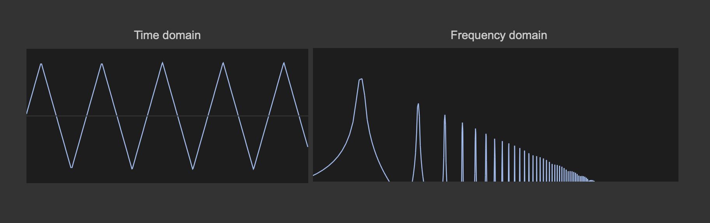

> [!NOTE]
> I intentionally removed all numerical references from the objects; to operate, these analysis tools ({scope~}, and {spectrumdraw~}) require an audio signal in a frequency range that is meaningful for audio applications. Therefore, showing "the numbers" wouldn't have made any sense. Still, i wanted to abuse them to illustrate the concept.

The two graphs above show the square's motion function from two different perspectives: 
- Left: the position moving linearly from the beginning to the end of the motion path.
- Right: the spectral decomposition of the motion function on the left.

By "breaking" the motion function into a combination of sine waves, we can see that multiple elementary waves of encreasing frequency and decreasing amplitude are required to give rise to the "triangular" motion our square is going through.

> [!NOTE]
> Actually, to combine into a perfect triangular path, an infinite amount of sine waves is needed.

What i'm intrested in is what happens to our motion function if we filter out some of the highest sine waves. To perform filtering, since we are the "~ realm", i'll use a simple audio low pass filter.

The low-pass filter attenuates high frequencies, and look at our motion function on the left: it is "rounded", showing juicy acceleration and deceleration phases! Controlling the low-pass filter cutoff, we can control the motion path roundness, mimicking a variation of the object's mass. This brings us to another way we can use to define non-linear motion:

> [!IMPORTANT]
> You can create a straightforward linear motion path (simple to define and control), interpret it in the frequency domain, and filter out the high frequencies. This process results in a smoother motion that naturally incorporates acceleration, deceleration, and inertia.

> [!NOTE]
> The filters described in the following section are infinite impulse response (IIR) filters that work in the time domain. When I mention "operate in the frequency domain," I’m not implying any spectral processing; rather, I’m referring to the filters' effect to reduce the amplitude of certain frequency ranges.

Let's bring this concept back to Jitterland and see how we can use it to improve object motion.

I've created a simple scene with a red sphere that moves randomly across the screen. The motion is smoothed with a low-pass filter using the {slide} object. The two graphs on the right show the unfiltered and filtered motions. Overall, the filtered movement looks realistic, with the sphere experiencing acceleration and deceleration. Here’s a side-by-side comparison of the unfiltered vs. filtered motion:

{slide} is a possible choice for filtering, but it's not the only one. Max offers a variety of low-pass implementations for audio signals, but there are few built-in options for filtering streams of messages, matrices, and textures. Still, we can build our filters from scratch. Let's see a couple of practical low-pass implementations for us, Jitterheads.

> [!NOTE]
> Digital filters can be tricky to navigate, and designing them is a complex subject that deserves its own in-depth discussion. For this article, I’ll focus on demonstrating some filter implementations without diving deeply into technical details. Instead, I'll provide qualitative insights and examples of when and how to use these filters, keeping things accessible and practical. (Plus, I’m not a filter design expert!)

#### One-pole filter

This is the simplest possible low-pass filter:

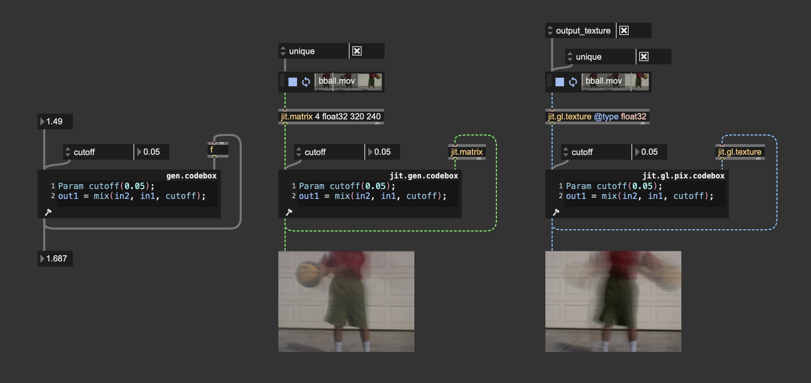

One-pole filters operating on messages, matrices, and textures. 

This low-pass filter, though simple, can be very effective. It works by averaging values from the current frame with values filtered from previous frames. Depending on how your position data is represented, you can customize a one-pole filter to smooth data like messages, matrices, or textures. The filter’s strength is controlled by an interpolation value (ranging from 0 to 1), which determines how much influence the current frame has versus the previous frame.

Since one-pole filters are 1st-order filters, they provide a gentle frequency cut of 6 dB per octave, resulting in smooth filtering. To make the filter more selective, you can increase the order by cascading multiple one-pole filters; each additional filter in the chain increases the overall filtering order by 1.

> [!NOTE]
> One-pole low-pass filters can be implemented in various ways, including using some built-in objects. I implemented it in a gen codebox to give a clearer view of the algorithm's inner workings.

#### Biquadratic filters and Butterworth filters

A filter can be constructed (in the case of an analog filter) or implemented (if digital) in various ways. A filter ***topology*** refers to the structural arrangement or configuration used to implement a filter in electronics or digital signal processing. The topology defines how components (such as capacitors, resistors, and inductors in analog filters, or coefficients and delays in digital filters) are organized and interconnected to achieve the desired filtering effect.

In the world of digital filters, a widely used filter topology is biquadratic filters (or biquad filter for short). These kinds of filters are very appreciated for their flexibility, as they can be used to implement different filter responses (low-pass, high-pass, band-pass, etc.).

Biquad filters rely on specific coefficients to control their operation. These coefficients allow you to decide which frequencies are boosted or reduced and determine the filter’s type. A biquad filter operates using a formula with five principal coefficients: $a0$, $a1$, $a2$, $b1$, $b2$. 

In practical terms, the filter equation looks like this:

$$
y[n] = \frac{a_0 \cdot x[n] + a_1 \cdot x[n-1] + a_2 \cdot x[n-2] - b_1 \cdot y[n-1] - b_2 \cdot y[n-2]}{a_0}
$$

Where:

- $y[n]$ is the output signal at the current sample.
- $x[n]$, $x[n-1]$, and $x[n-2]$ are the current and past input samples.
- $y[n-1]$ and $y[n-2]$ are the past two output samples.

And a Maxy implementation of such a filter topology looks like this:

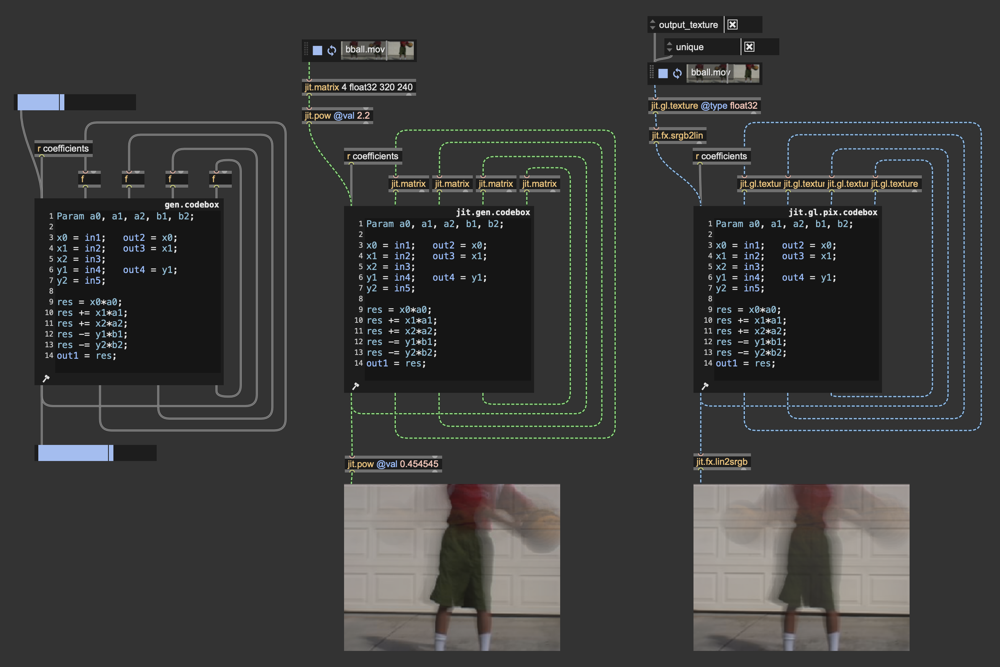

> [!NOTE]
> The objects {biquad~} and {jit.fx.ti.filter} implement biquad temporal filters like the ones displayed above.

How can we compute the correct filter coefficients to get the desired filter response? Each kind of filter has its onw coefficient calculation.

> [!TIP]
> I invite you to check out the patch "gen~.biquad.maxpat" for looking at various biquad coefficient computations:

For our goal, there's a specific filter response i'm particularly interested in: low-pass ***Butterworth filters***. Butterworth filters are a type of signal filter known for their maximally flat frequency response in the passband, meaning they allow frequencies up to a specified cutoff to pass through without significant attenuation or ripples. This makes Butterworth filters ideal when smooth, distortion-free filtering is needed. The transition from passband to stopband (attenuation region) is gradual compared to other filters, like Chebyshev or elliptic filters, which prioritize sharper cutoffs at the expense of flatness. Moreover, Butterworth filters generally offer a near-linear phase response, especially at lower frequencies, which minimizes phase distortion for signals passing through the filter. In other words, butterworth filters are designed to be as transparent as possible regarding the filtered signal.

We can implement a digital Butterworth filter response using a biquad filter. Let's see how to compute proper coefficients for this kind of filter:

To compute the coefficients $a0$, $a1$, $a2$, $b1$, $b2$ for implementing a Butterworth filter, we need to follow a systematic process. 

Define Parameters:
- Cutoff frequency $fc$ (in Hz) – the frequency at which the filter starts attenuating the signal.
- Sampling rate $fs$ (in Hz) – the rate at which the signal is sampled. In our case, the video frame rate.

The cutoff frequency (in the digital domain) needs to be pre-warped using the following formula:

$$
ωc = 2π * (fc / fs)
$$

Where $ωc$ is the angular frequency. The warped frequency is then:

$$
ωd = 2 * tan(ωc / 2)
$$

The coefficients for a 2nd-order low-pass Butterworth filter are calculated as follows:

$$
a0 = (ωd^2) / (1 + √2 * ωd + ωd^2)
$$

$$
a1 = 2 * a0
$$

$$
a2 = a0
$$

$$
b1 = (2 * (ωd^2 - 1)) / (1 + √2 * ωd + ωd^2)
$$

$$
b2 = (1 - √2 * ωd + ωd^2) / (1 + √2 * ωd + ωd^2)
$$

This is the coefficient computation implemented in Max:

Enough math; let's see how this filter looks! I designed a straightforward test patch where the colors of an input video are interpreted as 3D positions for a particle system. In particular, particles are distributed evenly across the horizontal dimension, and I computed the color luminance to affect vertical positioning.

https://github.com/user-attachments/assets/ab967640-0ed2-42f0-a89c-1cbc212b7d3c

The rendering looks "ok," but let's try to filter out the particle movement. 

https://github.com/user-attachments/assets/9b6d91e5-f33a-4896-9544-fdf12144d7af

The particles look way more lively! Let's now try using higher-order Butterworth filters. Here, I cascaded four filters to get 8th-order filtering; I also backed up the cutoff value a little because we don't need to roll it down so much to attenuate high frequencies with such a high-order filter.

https://github.com/user-attachments/assets/2c8569f9-3630-456f-a708-6d877726614f

The particle movement became "bouncier"! Before reaching the input position, each particle oscillates slightly. Cascading even more 2nd-order filters, the bouncing effect becomes more pronounced. We can even try to "trigger" a new particle arrangement and look at how the filter smoothens out motion:

https://github.com/user-attachments/assets/a7db5010-202c-446e-992e-39d732dcecb9

As you can see, decreasing the cutoff value resembles a mass increase. Since we have our Butterworth coefficients calculator exposed, we can go a step further and assign different cutoff values to each particle. I slightly reworked the coefficients calculator and the biquad filter to read from matrices the coefficient values.

The coefficient calculator has been turned into a {jit.gen.codebox} to operate on matrices, but the code stays the same.

And in the biquad computation, coefficients are no longer provided as params but as matrices.

With control over individual cutoff values, you can differentiate the object's behavior. In the patch below, I had fun generating random cutoff values (in the range [2;4]), and then I tried to assign progressively increasing cutoff values (from left to right). With this degree of control, you can create very interesting animations.

https://github.com/user-attachments/assets/20d97fc4-999a-4f2f-a23d-76a5b91b9b0c

Filters are an excellent tool for enhancing the appearance of complex object motion, with Butterworth filters being especially well-suited for this purpose. Much like motion functions, filters allow you to smooth a motion path by providing a linear motion as input, producing results that naturally reflect physically plausible behavior. However, this approach to motion smoothing has a limitation: filters tend to introduce a slight delay in timing, reducing temporal precision. In the end, there’s no single best approach—each situation calls for the right tool to achieve the desired effect.

It’s worth highlighting that Max provides a set of objects specifically crafted to simplify object motion management: {jit.anim.drive}, {jit.anim.path}, and {jit.anim.node}. These objects are ideal for high-level motion control, as they can be adjusted through intuitive, meaningful parameters. Additionally, a set of external objects called “ease” provides tools for defining motion functions without needing to dive deeply into the underlying math. Max, as always, is a highly modular, multi-level programming environment, allowing you to find solutions that best suit your needs.

## Motion blur

Oh, no! Moving squares, AGAIN?!?!1! That's the last time, i swear... Which one moves "better" ?

You should know it by now... the blu one always wins.

Both squares are going under the same (quintic) motion, but the rendering of the blu square incorporates ***motion blur***.

Motion blur is a visual effect that simulates the natural blurring of moving objects, helping to make animations and videos look more realistic. Imagine when you take a photo of a fast-moving car, and it appears slightly blurred along its path; that's motion blur at work! This happens in real life because, during the time it takes to capture the image, the car moves, creating a streak or blur along its direction of motion.

We can replicate this effect to give the impression of speed and smoothness. Motion blur can enhance the realism of fast-paced scenes by blurring objects in the direction of motion, making them look less "stiff" or "choppy." Let's break down the real-world phenomena that lead to motion blur:

Motion blur arises in photography when there is relative motion between the camera sensor and the subject during the exposure time. Exposure time, also known as shutter speed, is the duration for which a camera’s sensor (or film) is exposed to light. During this time, the camera’s shutter is open, allowing light to reach the sensor and create an image. In 3D rendering, time is discretized into frames, which are "undivisible" time units; in such a context, we can think of exposure time as the intra-frame time (the time elapsed between one frame and the next). When rendering a scene, objects appear istantaneously on screen at each frame, and there's not an intermediate phase in which the virtual camera is exposed to light, hence no motion blur is rendered. If we want to add this effect to our images, we have to make it ourself.

There are several methods to create a motion blur effect, and the choiche of which to use depends on the rendering method we're using, the time budget we have for rendering a frame, and the kind of rendered scene. Here's a list of some approaches to motion blur rendering:

### Ray-traced motion blur

This sounds fancy, but in reality is the simplest way to create blurry motions as it replicates the phenomena that produce the blur in the real world. If you're rendering your scene using a ray-based method (e.g., ray marching or path tracing) you assing meaningful colors to the pixels by "shooting" rays from the camera point of view into the scene, finding the intersections of each ray with the surrounding geometry, and computing light transport to shade the pixels. This process is repeated multiple times per frame, gathering numerous samples from the scene and averaging their color contributions; If you move the objects in the scene or the camera itself while collecting color samples, is like having a motion happening during the exposure time. As result, the rendered images will naturally account for motion blur. 

> [!NOTE]
> This guide is not about implementing ray-tracing rendering solutions, but since that's feasible with standard Max + custom shaders, i thought to include this method to give the reader a broader perspective on the topic.

### Motion blur by accumulation

We said that in digital rendering images "appear" istantaneously at each frame. Consider an object at frame $f$ to be in position $p_{f}$ which was in position $p_{f-1}$ at the previous frame $f_{-1}$. When rendering frames $f_{-1}$ and $f$ in succesion, the object appears as jumping from $p_{f-1}$ to $p_{f}$. If all we can do is to render an object in a single specific position at each frame, we could recreate the effect of a motion trail by rendering multiple objects covering a set of positions between $p_{f-1}$ and $p_{f}$.

Motion blur through accumulation consists of rendering the same object multiple times filling the space between $p_{f-1}$ and $p_{f}$ through a "gradient" of intermediary positions.

Let's set it up in Max:

In the left-top corner of the patch, i'm generating a motion path, and at each frame i store the current and the previous (horizontal) postions into the {pv} objects labeled "curr" and "prev". The right side is where the accumulation takes place. There's a square drawn with the object {jit.gl.gridshape}, which is set to @automatic 0, meaning it doesn't render automatically to screen at each frame, but only when it receives a bang message (or a "draw" message). {jit.gl.gridshape} has been bound to a {jit.gl.node} object which is rendering to a texture through the attribute @capture 1. A nice thing about {jit.gl.node} is that it reports from the right-most outlet when the capturing phase begins via "begin_capture" messages. When the capturing phase begins, it triggers the drawing of multiple copies of the square. In the patch an {uzi} object shots 80 iterations of the drawing process; at each iteration, the previous and the current positions are linearly interpolated and a square is drawn at the resulting position.

> [!NOTE]
> {uzi} is set to count from 1 to 80, and in the interpolation process i divided the iteration index by 80. This means that the interpolation factor for the function "mix" goes from 0,0125 up to 1. I'm intentionally avoiding an interpolation factor of 0 to not re-draw a square at the exact previous position. The difference is visually unnoticeable, but i felt like it was more conceptually consitent.

The patch succesfully draws 80 progressively shifting copies of the square, but the result doesn't look like a proper blur; it's more like an expanding rectangular block. That is because we're violating the laws of energy conservation. We won't end up in jail for that, but we surely must account for it. 

Think again at the real world example where a camera takes a picture of a moving object. The light reaching the camera sensor is the same light that bounced off the subject of our picture towards the camera. If the subject is moving or still, the amount of energy (light) hitting the camera sensor must be the same. In our example, we're drawing 80 copies of the square without changing the amount of light they reflect towards the digital camera, meaning that we're increasing the emitted light intensity by a factor of 80. To fix it, we have to divide the amount of emitted radiance of each copy by $N$, where $N$ is the number of copies, so that the total amount of emitted light sums up to 1. In other words, we have to compute an average. 

Now, we're not rendering each square to a separate texture; if that was the case, we could have performed a running average over the rendered textures. What we're doing is rendering the copies of the square to the same render target. Therefore, if we want to compute an average (sum and divide by $N$), we must do it at the rendering stage. 

With that in mind, this is how our patch looks like now:

I enabled {jit.gl.gridshape}'s color blending via @blend_enable 1 and i disabled depth testing with @depth_enable 0. The blending mode has been set to @blend "add", because if we need to perform an average computation, we must sum the colors of each square. Prior to rendering, the squares' color intensity has been divided by the number of copies.

This "time interpolation" process must be applied to any parameter that influences positioning, such as scaling and rotation.

I created a short sequence for position, scaling, and rotation using linear piece-wise functions passed through our "quintic bender". The patch stores both the values at the current frame and at the previous frame for later interpolation. To let scaling and rotation create motion blur, the right half of the patch now looks like this:

Rotation and scaling go through the same treatment as position values.

> [!NOTE]
> In the patch, I explicitly stored position, rotation, and scaling for later manual interpolation. One could act smart and store the current and previous states of {jit.gl.gridshape} as presets and interpolate between them using Max built-in tools.

To make a fair comparison, this is the same scene rendered without and with motion blur:

The animation looks smoother overall, and we perceive the motion's speed and direction better, particularly when the shape moves fast.

You may have noticed that i'm rendering the scene at 30 fps ({jit.world}'s @fps 30.). Motion blur is about capturing the intra-frame movement, and the longer the exposure time, the more evident the blur. To increase the exposure time you should use low @fps values, as $exposuretime = 1s / fps$. 

> [!IMPORTANT]
> The number of frames per seconds influences the animations' overall look - Very low frame rates (from 10 to 20 fps) make you video look like a hand-draw cartoon (especially when motion blur is disabled); low frame rates (from 24 to 30 fps) produce a cinematic look; higer frame rates (40 - 60 fps) result in videogame-like animations. 

Now that we have the basic setup for applying motion blur let's have fun with a larger-scale scene. I recreated one of the most iconic effects ever: the Rutt-Etra video synthesizer. I'm distributing some lines on a plane and determining the height of the lines using the luminance from a video.

The render looks like this:

https://github.com/user-attachments/assets/063b540b-4a1e-4bb6-8b86-2e26082e10f8

And with motion blur enabled:

https://github.com/user-attachments/assets/d851aa1c-83ef-4553-a17c-1ae174384511

Video compression is not helping in showing the difference, but it can be better grasped with a side-by-side still image:

Let's see how to add motion blur in this context. The lines' position is no longer determined by a single @position parameter; instead, we store the position of the vertices using matrices. Therefore, to store the current and previous positions, we can use use {jit.matrix} instead of {pv}.

And this is how i'm managing the accumulation process:

The linear interpolation between the set of current postitions and the set of previous positions is computed with the object {jit.xfade}. To set the desired transparency for the lines, the alpha component of the lines' color is divided by the total number of copies. You can disable motion blur by setting the number of copies to 1 (only the current set of positions gets rendered).

I like the result, but there's still something we're not considering; let's try to stop the video player and let's move the camera around.

https://github.com/user-attachments/assets/ca1cf709-d9cd-40c3-8fa1-097fd1370141

The camera movement doesn't produce any blur. As we said at the beginning, motion blur arises when there's a relative motion between the camera and the objects in the scene. Hence, we have to consider the camera motion as well. To make it happen, we almost have all we need already. The geometry is rendered multiple times in each frame (50 times in the above patch), so we need to temporally interpolate the intra-frame camera movement and render each copy of the geometry as seen from different camera positions.

For a clearer implementation, i re-designed the acculumation process using wireless connections:

Interpolating camera positions can be somewhat complex. To move the camera using {jit.anim.drive}, two {jit.gl.camera} objects are required. The first camera, referred to as the "dummy" camera in the patch, is controlled by {jit.anim.drive} and provides its current position as well as its previous position. These positions are queried from the dummy camera and stored in two {pv} objects. The second camera is used for rendering, interpolating linearly the current and previous positions.

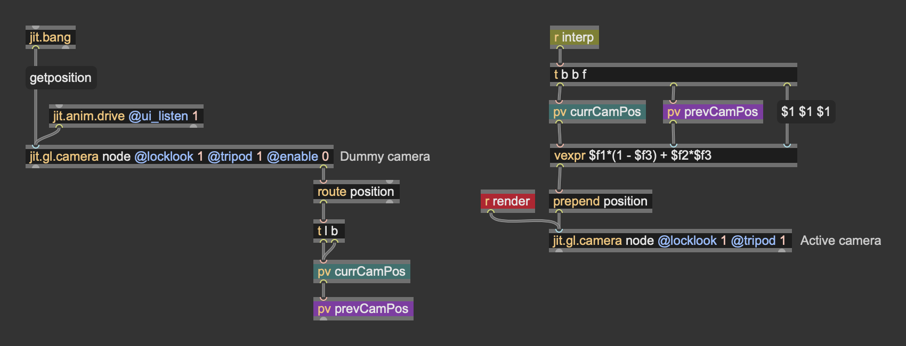

Finally, also the camera movement incorporates motion blur:

https://github.com/user-attachments/assets/20484751-968c-407f-945b-98738f63ca68

> [!NOTE]
> In the examples above the intra-frame motion is computed interpolating linearly between the current position ($P_{f}$) and the previous position ($P_{f-1}$). This means that the intra-frame motion is slways a straight line. For fast movements with frequent changes in direction, it may be worth using different forms of interpolation capable of producing curved paths (e.g., cubic spline interpolation), at the cost of longer history of position values required.

Motion Blur by Accumulation is a powerful method to create a blur effect along the direction of an object’s motion. However, it comes with some challenges:

#### High Computational Cost:

This technique requires rendering multiple copies of the geometry, which can be resource-intensive, especially for real-time applications.
Reducing the number of copies is an option, but it often results in visible artifacts. The blur may appear discontinuous, and individual geometry copies may become discernible, forming regular, unwanted patterns.
If you need to reduce the number of copies, consider these strategies:

- Add Randomness: Instead of regular sampling (linear interpolation), use quasi-random sequences, such as Halton sequences or blue noise, for temporal interpolation. This introduces randomness that helps mask the low number of copies. Our brains are excellent at detecting patterns, so replacing regularity with randomness can effectively smooth the motion blur (a Monte Carlo-inspired approach).
- Adaptive Copy Count: Adjust the number of copies based on the displacement between frames. For example:
If a geometry remains stationary between frames, a single copy suffices since no motion blur is needed.
For geometries with significant displacement between frames, increase the number of copies to adequately cover the motion path.
This approach requires computing the displacement for each point (e.g., from position $P_{f-1}$ to $P_{f}$) and setting the copy count accordingly. Additionally, adjust the object's color to maintain energy conservation, ensuring the blur effect remains visually consistent.

> [!IMPORTANT]
> All the patches shown in this paragraph operate on positional data stored and processed by the CPU. For faster execution times, it's possible to replicate the accumulation process on the GPU, using {jit.gl.buffer} or {jit.gl.texture} instead of matrices, and using custom geometry shaders or GPU instancing for drawing the geometry. 

#### Transparency Requirement:

This method relies on blending during the rendering stage, making it suitable only for semi-transparent objects.
This introduces complications with rendering order and depth sorting, as transparent objects often require careful handling to avoid visual artifacts.

#### Practical Usage
Due to these constraints, motion blur by accumulation is typically applied to simple geometries like points and lines. For more complex geometries, alternative techniques may be more suitable. If you need to blur complex objects, consider other methods that circumvent these limitations.

### Motion blur as post-processing effect

Motion Blur as a Post-Processing Effect is a technique used in computer graphics to simulate the visual blur that occurs when objects or the camera move quickly during a scene. Unlike geometry-based motion blur, which involves modifying or duplicating the geometry during rendering, post-processing motion blur is applied as an image-based effect after the main rendering process is complete. A motion blur effect can be implemented following these steps:

1) Render the scene as usual.
2) Render motion vectors for each pixels. Motion vectors are mathematical representations of the movement of pixels or objects between consecutive frames in a video or rendered scene. They describe the direction and magnitude of movement in screen space. In Max you can render motion vectors by setting the @capture attribute of {jit.gl.node} to the value 3; this will make {jit.gl.node} render to 3 distinct render targets (textures), and the third one will contain motion vectors, encoded as red = horizontal movement, and green = vertical movement.
3) Make the blur: the motion vectors are used to determine the direction and intensity of the blur for each pixel.
Using the motion vectors, neighboring pixels are sampled along the direction of motion to create a streaking or smearing effect.
4) Composite: the blurred pixels are combined with the original image to produce the final frame, giving the illusion of motion blur.

> [!NOTE]
> Some advanced motion blur effects may need additional steps, like rendering the distance of each pixel from the camera (depth).

In max you can implement this process yourself, using custom shaders, or you can use {jit.gl.pass} @fxname motionblur. This effect implements a motion blur filter using the steps described above. As long as all objects in the scene are shaded by either {jit.gl.material} or {jit.gl.pbr}, this pass FX will produce a blur when the objects or the camera move.

This is a scene rendered using the motion blur pass effect:

Left: motion blur enabled; Right: motion blur disabled.
This effect has a single control, @velocity_scale, which determines the amount of blur to apply in the direction of motion. 

Post-processing motion blur effects are widely used, because they're not as demanding as the accumulation approach in terms of computational resources. Still, they have one major disadvantage: the motion blur effect is limited to the confines of the object itself.

When an object moves, the motion blur appears accurate only within the boundaries of its original shape. This limitation arises because motion vectors, which guide the direction and intensity of the blur, are inherently tied to the object’s silhouette. As a result, the blur cannot extend beyond the object's outline.

This results in uncorrect blurring of the object's edges. 

> [!NOTE]
> Various techniques have been developed to address this limitation, such as deforming the geometry in the direction of motion or "inflating motion vectors." The latter involves extending the motion vectors beyond the object's original boundaries, allowing the blur to extend past the shape's silhouette. While these methods help mitigate the issue, they can introduce new challenges. For instance, a stationary background object might appear blurred even if it isn’t moving. Currently, these methods are not implemented in Max due to their highly context-specific nature. However, I encourage you to explore and experiment with these approaches by creating custom shaders.

This concludes our in-depth look at some of tools we can use to improve the motion of objects on screen. In conclusion, there is no universally correct or incorrect way to utilize the tools and techniques discussed. Each method serves as a creative option in your toolbox, and the decision on which to use should be guided by your artistic intent, the performance limitations of your hardware, and the specific message or mood you wish to convey through your rendering. Whether prioritizing realism, stylization, or efficiency, the power lies in your ability to adapt these tools to meet the unique needs of your project and bring your vision to life.

# Eye candies

You set up an incredible scene with realistic motion and breathtaking lighting, but you need that extra 2% spiciness. This is a list of post-processing effects that can give you that extra push.

## Grain

A "grain" effect, often referred to as film grain, is a visual effect that simulates the appearance of tiny particles or irregularities that are typically found in analog film stock. This effect mimics the texture of classic film, replicating the random, slightly gritty pattern that comes from the natural silver halide crystals used in old film emulsions. Adding film grain to your rendering may serve different purposes:

- Digital footage is often very clean and sharp, sometimes to the point of feeling too clinical or lifeless. Grain can add a subtle layer of texture that makes the image appear more organic. This depth can help avoid the "flat" look that some digital video has and make scenes appear more immersive and visually interesting.

- If your render contains composited elements (such as 3D elements, images, and videos), adding a grain FX can help make these disparate parts feel more cohesive. Grain effectively "glues" the visual layers together because the consistent texture over the entire frame helps everything blend in more naturally.

- Grain can also be used to mask minor flaws in footage, such as noise, slight color banding, or imperfections from upscaling lower-resolution video. By adding a layer of grain, you create a visual distraction that makes these issues less noticeable.

To add film grain to your renders in Max, you can use the {jit.gl.pass}' effect called "grain".

The pass FX "grain" is controlled by few simple parameters:
- @grain_amount determines the amount of grain to apply
- @grain_size controls the dimension on the silver halide crystals
- @colored is a boolean control to decide between monochromatic and colored grain
- @color_tint controls the grain color tint (only working with @colored 1); you can use this control to give a tint to the film grain, simulating different film models.

> [!IMPORTANT]
> Film grain must be applied after tonemapping, and before gamma correction. The grain is added to the color values, hence, if colors are clipped, no grain will be visible in the image. Also, it must come right before gamma correction, with no intermediary effect; since the grain effect simulates the behavior of the support (film) capturing the animated sequence, it should be placed last and shouldn't be affected by any other effect (other than gamma correction).

## Vignette

A vignette effect is a visual effect that gradually darkens or lightens the edges of the video frame, leaving the central part of the frame more prominent. The primary purpose of a vignette is to draw the viewer’s attention towards the center of the frame or a key subject. By slightly darkening the edges, the eye is naturally guided to the brighter, central part of the scene. This is particularly useful when you want to make sure that viewers are focusing on the main character or critical action in the shot. 

Vignetting is often associated with traditional cinematic visuals, as it was originally a natural characteristic of old lenses and film stock. Adding a vignette gives your video a subtle, filmic quality that can feel sophisticated, adding a professional aesthetic that makes your footage feel more like something seen in the movies!

To add a vignette effect in Max you can use the {jit.gl.pass}' effect called "vignette".

This pass effect is controlled by the following attributes:
- @center sets the normalized coordinates of the vignette's center.
- @expand controls the steepness of the transition from the uneffected vignette center to the darker areas
- @falloff controls at which distance from the vignette's center the darkening effect begins
- @exposure controls post-vignette exposure. Use this attribute if you need to gain back some brightness after applying the vignette
- @anamorphic is a boolean control that let you decide between non-anamorphic (0) and anamorphic (1) vignetting. 
- @bars creates two black bars at the top and the bottom of the image. Use this functionality to give a cinematic wide-screen look to your render. 

> [!TIP]
> Consider applying an off-center vignette to highlight and emphasize the light originating from a specific direction:

## Bloom

The bloom effect is a visual effect that simulates an intense, glowing halo of light that appears to “bloom” or spread out beyond the bright areas of an image, giving the impression of light spilling over into surrounding parts of the frame. Bloom is often used to emulate HDR, making it feel like the bright parts of the image are more intense than what a standard screen can naturally produce. It helps accentuate highlights without losing too much detail, creating a sense of depth between the shadows and light areas. The bloom effect helps to ensure that those bright regions feel vivid and realistic, enhancing the sense of dynamic range.

In older lenses, bright highlights tended to bloom as the light scattered inside the lens elements. Adding a bloom effect helps replicate this imperfection, which is often perceived as aesthetically pleasing because it adds a bit of warmth and life to a shot. Many filmmakers appreciate this look for the same reason they add grain—it gives the footage a more human and imperfect quality, moving away from the stark, clinical sharpness of modern digital cameras.

In Max you can create a bloom effect using {jit.gl.pass} @fxname bloom-hq

The two main control paramters for this pass effect are:

- @bloom_amt controls the intensity of the bloom effect
- @threshold sets the lowest luminance that can produce a bloom effect

> [!IMPORTANT]
> The bloom-hq pass effect has been designed to be a "finisher" effect, and it implements tonemapping (ACES) and gamma correction functionalities enabled by default. If you want to manage tonemapping and gamma correction manually (which i recomend), disable the attributes @tonemapping and @gamma_correction. Moreover, the bloom effect must always come before tonemapping in the processing chain because it works by adding bright color values to the original image, very often leading to color clipping. Tonemapping after the bloom FX ensures colors don't exceed the value 1.

---

